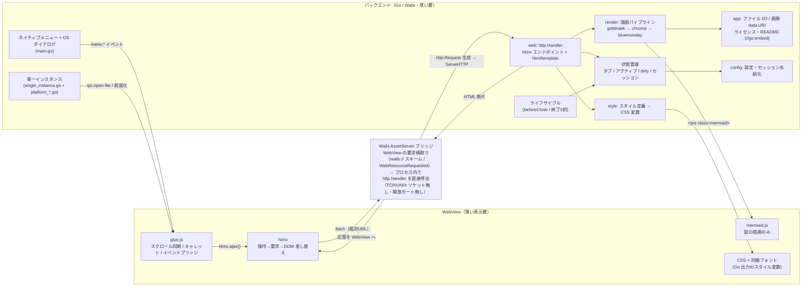

# Markmiru Go 中心化 移行設計

最終更新: 2026-06-29
ステータス: **設計（未実装・目標アーキテクチャ）**

[`技術選定.md`](技術選定.md)／[`代替技術調査.md`](代替技術調査.md) で決定した **Go 中心（Go-SSR）構成**を実装へ落とすための設計と移行計画。本書は「これから到達する姿」を示す。**現行実装（Wails＋Svelte/TS）の仕様は [`アーキテクチャ・画面設計.md`](アーキテクチャ・画面設計.md) と git 履歴**を参照。

---

## 0. ゴール

- 自作のアプリロジック・描画処理を **Go に集約**する（Markdown 描画・サニタイズ・ハイライト・状態管理・HTML 生成）。
- JavaScript は **純 Go 代替が無い既製ライブラリ（mermaid.js・htmx）＋数百行のグルー**に限定。
- Svelte/TypeScript の自作コードと **Node/npm/Vite のビルド一式を撤去**。
- 要件（MUST/SHOULD）と既存の挙動は**維持**（閲覧重視・マルチタブ・2モード・セキュリティ防御・単一インスタンス・セッション復元）。

## 1. 全体構成

```
┌────────────────────────── Go プロセス（厚い層） ──────────────────────────┐
│  Wails v2 ランタイム（ウィンドウ・ネイティブメニュー・OS ダイアログ）         │
│  状態: タブ集合 / アクティブ / dirty / セッション / スタイル                 │
│  描画: goldmark → chroma → bluemonday → html/template                      │
│  I/O: ファイル読書き・設定永続化・単一インスタンス IPC・画像 data URI 化       │
│  HTTP: AssetServer.Handler（htmx エンドポイント＝HTML 断片を返す）           │
└───────────────────────────────────┬───────────────────────────────────────┘
                                     │ Go 生成 HTML / HTML 断片
                                     ▼
┌────────────────────── WebView（薄い表示層） ──────────────────────────────┐
│  htmx（操作→Go へ要求→断片を DOM 差し替え）                                  │
│  mermaid.js（`<pre class="mermaid">` を図に描画）                            │
│  グルー JS（編集オーバーレイのスクロール同期・最小限の即時反映）              │
│  CSS（Go が出力するスタイル変数 ＋ ベース CSS ＋ 同梱フォント @font-face）     │
└───────────────────────────────────────────────────────────────────────────┘
```

### 1.1 全体アーキテクチャ図（最終形態）

移行フェーズ完了後の責務分離。Wails の構造（Go ＋ OS 標準 WebView）は維持しつつ、Svelte/TS を廃し **Go を厚い層**にする。[`アーキテクチャ・画面設計.md`](アーキテクチャ・画面設計.md) §1 の現行図と対になる「到達後の姿」。

- **Go（厚い層）**: 状態管理（タブ／アクティブ／dirty／セッション／スタイル）、Markdown 描画（goldmark → chroma → bluemonday）、HTML 生成（`html/template`）、htmx エンドポイント（`http.Handler`）、ファイル I/O・画像 data URI 化、ネイティブメニュー・OS ダイアログ、単一インスタンス、設定・セッション永続化、ライフサイクル。
- **WebView（薄い表示層）**: Go 生成 HTML の表示、htmx（操作→Go へ要求→DOM 差し替え）、mermaid.js（図の描画のみ）、glue.js（スクロール同期・キャレット操作・イベントブリッジ）、CSS ＋ 同梱フォント。
- 連携は **htmx のリクエスト ↔ Go の HTML 断片応答**が主軸。ただしこれは**実通信ではない**: Wails の AssetServer が WebView の要求横取り（macOS/Linux=`wails://` スキーム、Windows=WebView2 の `WebResourceRequested`）を受け、`http.Request` を組み立てて**プロセス内で `http.Handler` を直接呼び出す疑似 HTTP**（TCP/UNIX ソケットなし・開放ポートなし）。`http.ListenAndServe` は使わない。
- ネイティブメニュー／IPC は Wails イベント →glue.js→ `htmx.ajax()` で**画面操作と同じエンドポイント**に合流。OS ダイアログ・クリップボードは Wails バインディング（Go）。



> 対比: 現行は「Svelte が状態・描画・編集を持つ厚いフロント＋薄い Go」だが、最終形態は「**Go が状態・描画・HTML 生成を持つ厚い層＋薄い WebView**」へ反転する。WebView 内の自作物は glue.js のみ（mermaid.js・htmx は既製ライブラリ）。

## 2. Wails での Go-SSR の実現方法

- **動的 HTML**: Wails v2 の `assetserver.Options.Handler`（`http.Handler`）に Go のルータを載せ、htmx からの相対 URL リクエストに **HTML 断片**を返す。`Middleware` で共通処理（CSP ヘッダ付与等）。
- **静的アセット**: `htmx.min.js` / `mermaid.min.js` / フォント woff2 / ベース CSS を `//go:embed` で同梱（バンドラ不要・直 vendor）。
- **ネイティブメニュー → 画面反映**: メニュー（既存の `app.emit("menu:*")`）は Go 内でロジックを実行し、結果を WebView に反映する。反映は次のいずれか:
  - Wails の `EventsEmit` を小さな JS が受け、`htmx.ajax()` で該当領域を再取得、または
  - htmx の `hx-trigger`（カスタムイベント）で領域を更新。
- **OS ダイアログ**: ファイル選択・保存等は従来どおり Go の `runtime.*Dialog`（既に Go）。**アプリ内ダイアログ**（保存確認の3択・危険確認）は Go が HTML 断片で描画し htmx で表示する。
- **バインドメソッドの縮小**: 現状フロントが呼ぶ多数のバインドは、大半が **HTTP ハンドラ**へ移行。OS 機能（ダイアログ・クリップボード・ウィンドウ）に関わるものだけバインドとして残す。

## 3. Go パッケージ構成（案）

| パッケージ | 役割 | 由来 |
|---|---|---|
| `main` | Wails 起動・ネイティブメニュー構築 | 既存 `main.go` を流用 |
| `app` | ライフサイクル・状態（タブ/セッション/スタイル）の集約 | 既存 `app.go` を拡張 |
| `config` / `single_instance` / `platform_*` | 設定永続化・単一インスタンス・OS 依存補助 | **既存をほぼそのまま流用** |
| `render`（新規） | goldmark＋chroma＋bluemonday で MD→安全 HTML | renderer.ts を置換 |
| `web`（新規） | `http.Handler`・`html/template`・htmx エンドポイント | Svelte コンポーネント＋commands/menu を置換 |
| `style`（新規） | スタイル定義（Go 型）→ CSS 変数生成 | style.svelte.ts / styleDef.ts を置換 |
| `assets` / `templates`（embed） | 静的 JS/CSS/フォント・HTML テンプレート | frontend/ を再編 |

## 4. Markdown 描画パイプライン（Go）

1. **goldmark**（CommonMark＋GFM＋脚注）で AST/HTML 化。
2. レンダラ拡張で:
   - コードブロック（言語名 `mermaid`）→ `<pre class="mermaid">…</pre>`（WebView の mermaid.js が描画）。
   - その他のコード → **chroma** で色付け HTML。
3. **bluemonday** のポリシーでサニタイズ（許可タグ・属性、外部リンクへ `rel` 付与、外部画像の制御）。
4. `html/template` で本文テンプレートへ埋め込み、断片として返す。

- **画像**: ローカルパス（相対・絶対・ルート相対）は Go が data URI 化（既存 `ReadImageAsDataURL` を流用）。外部（リモート）画像は bluemonday ポリシー＋**ファイル毎の表示可否確認**（既存仕様を Go/htmx で再現）。
- **セキュリティ**: 本番は CSP を `Middleware` で注入。外部リンクはクリック時に確認 →`BrowserOpenURL` で OS ブラウザへ委譲（既存 `links.ts` の考え方を htmx＋Go で再現）。mermaid は `securityLevel: 'strict'` を維持。

## 5. 画面と htmx エンドポイント（案）

| メソッド/パス | 役割 | 返すもの |
|---|---|---|
| `GET /` | アプリシェル（タブバー＋本文領域＋サイドバー） | 全体 HTML |
| `POST /tabs/open` | ファイルを開く（OS ダイアログは Go） | 更新後のタブバー＋本文 |
| `POST /tabs/{id}/activate` | タブ切替 | 本文領域 |
| `POST /tabs/{id}/close` | タブを閉じる（未保存なら3択ダイアログ断片） | タブバー or ダイアログ |
| `POST /tabs/{id}/mode` | 閲覧/編集 切替 | 本文領域（閲覧 or 編集オーバーレイ） |
| `GET /tabs/{id}/view` | 閲覧 HTML（§4 のパイプライン） | 本文断片 |
| `GET /tabs/{id}/edit` | 編集オーバーレイ初期 HTML | 本文断片 |
| `POST /tabs/{id}/content` | 編集中の本文更新（dirty 更新＋再ハイライト） | ハイライト層断片 |
| `POST /tabs/{id}/save` | 保存（無題は OS 保存ダイアログ） | タブバー（dirty 解除） |
| `POST /sidebar/toggle` | サイドバー開閉 | サイドバー断片 |
| `POST /style` | スタイル変更（設定パネル） | `<style>` 断片 |
| `GET /find` / `POST /find` | ページ内検索 | 検索 UI／ハイライト |
| `GET /doc/{license\|about}` | 同梱ライセンス／README タブ | 読み取り専用本文 |

- ネイティブメニュー（新規/開く/保存/印刷/モード切替/サイドバー/スタイル入出力/検索/About/ライセンス）は、対応する Go ロジックを呼び、上記領域を再描画する。

## 6. 編集モード：透明 textarea オーバーレイ ＋ chroma

```
[container]  position: relative
 ├─ <pre class="hl">   層1: chroma 出力の色付け HTML（表示専用）
 └─ <textarea>         層2: 透明文字＋実キャレット（編集・入力を担当）
```

- **フロー**: `textarea` の `input` を**デバウンス**し `POST /tabs/{id}/content` →Go が dirty 更新＋ chroma で色付け →層1（`<pre>`）を htmx で差し替え。
- **スクロール同期**: `textarea` のスクロールに合わせて `<pre>` を追従させる**数十行のグルー JS**（オーバーレイ手法の必須最小部分）。
- **本文・dirty は Go が保持**。保存・終了確認も Go 側ロジック。
- 行番号・矩形選択等の高機能は持たない（閲覧重視・編集は軽微修正 SHOULD のため許容）。ライト/ダークは chroma テーマ切替で対応。

## 7. 状態管理・セッション

- **タブモデル**（パス・名前・内容・savedContent・mode・readOnly・remoteImagePolicy）と**アクティブ/集合**を Go が保持。dirty 判定も Go。
- **セッション復元・設定永続化**は既存 `config.go` を流用（既に Go）。`commands.ts` のロジック（開く／保存／**終了3択ループ**／**セッション復元**／スタイル入出力）を **Go へ移植**。
- 復元時は常に閲覧モードで開く既存仕様を踏襲。不在ファイルは1件ずつ確認ダイアログ（断片）。

## 8. スタイルとフォント

- **スタイル定義**を Go 型へ移し、**CSS 変数（`--md-*`）を Go が生成**（`styleDef.ts` の `styleToVars` 相当）。プリセット（ライト/ダーク/GitHub 風/セピア）も Go に定義。エクスポート/インポートの封筒 JSON も Go で処理。
- **フォント**: Noto Sans JP / Serif JP / Sans Mono の woff2 を**直 vendor**し、`@font-face` CSS を Go が出力して embed（`@fontsource` 廃止）。フォント実体の OFL 義務は不変。
- **ライブプレビュー**: 設定スライダー変更 →htmx（デバウンス）で `<style>` 断片を差し替え。体感が不足する場合のみ、**CSS 変数だけを即時更新する最小 JS** を許容（確定値は Go へ保存）。→ §11 リスク参照。

## 9. ビルドの単純化

- **撤去**: Node.js / npm / Vite / Svelte / `frontend/package.json` / `package-lock.json` / `.npmrc` / volta 固定。
- **再編**: `frontend/` を `assets/`（静的 JS/CSS/フォント）と `templates/`（HTML）へ。`wails.json` の `frontend:install`/`frontend:build`/`dev:watcher` を撤去または簡素化。
- **ビルドスクリプト**: `build.ps1`/`build.sh` の **node/npm 固定版チェックを削除**。ビルドは「Go＋Wails」のみ。SHA 埋め込み・`dist/` ZIP 出力は維持。
- **HMR は使わない（開発中も）**: 本プロジェクトの方針として、開発中であっても HMR（Hot Module Replacement）を使用しない。Vite 撤去により HMR は本来無くなるが、新方式でも再導入しない。素早い反映が必要なときは Go 再ビルド＋WebView リロードで対応し、開発と本番の挙動を一致させる。
- **`LICENSE.md` 更新**（§ライセンス調査の計画どおり）: goldmark/chroma/bluemonday/mermaid.js を追加、JS 系（markdown-it 系・highlight.js・DOMPurify・CodeMirror・Svelte・@fontsource）を削除。Noto フォント（OFL）の記載は残す。htmx（0BSD）は任意で記載。

## 10. 移行フェーズ（各段階で正式ビルドが通る状態を維持）

機能停止を避けるため**ボトムアップで段階移行**する。前半は Svelte シェルを残したまま中身を Go へ移し、UI シェルの置換は後半に一括で行う。

| Phase | 内容 | 完了時の状態 |
|---|---|---|
| **0** | 計画確定・`go.mod` に goldmark/chroma/bluemonday 追加 | 依存導入のみ。挙動変化なし |
| **1** | `render` パッケージ実装（MD→安全 HTML）。Svelte の `Preview` を Go バインディング呼び出しに置換 | **描画パイプラインが Go 化**（markdown-it/highlight.js/DOMPurify を撤去）。UI はまだ Svelte |
| **2** | `commands.ts`/`stores` のロジック（開く・保存・終了3択・セッション復元・スタイル）を Go へ移植 | **アプリロジックが Go 化**。UI はまだ Svelte（薄くなる） |
| **3** | `web` パッケージ（http.Handler＋html/template＋htmx）で**UI シェル（タブ/サイドバー/閲覧）を Go-SSR 化**。Svelte シェルを置換 | **UI が Go-SSR＋htmx 化**（大きな切替点） |
| **4** | **編集オーバーレイ**（textarea＋chroma）実装。CodeMirror 撤去 | 編集も Go 中心化 |
| **5** | 設定パネル・各ダイアログ・検索を htmx 化 | 全画面が Go-SSR |
| **6** | **Node/Vite/Svelte 撤去**、`frontend/` 再編、ビルドスクリプト簡素化、`LICENSE.md`・各ドキュメント（アーキテクチャ・画面設計／利用ライブラリ一覧／AGENTS／README）更新 | 「ほぼ Go」完了 |

> 注: Phase 3 が最大の不連続点。ここはブランチ上で新シェルを十分作り込んでから切り替える。Phase 1〜2 は既存 UI を保ったまま Go 率を先行して高められる低リスク区間。

## 11. リスク・未確定事項

- **設定ライブプレビューの体感**: htmx ラウンドトリップで十分か、最小 JS の即時反映が要るか。実装時に計測して決める（§8）。
- **chroma のテーマ品質**: JS の Shiki ほどの精緻さは無い可能性。CSS 補正で許容範囲に収める。
- **ページ内検索 UX**: WebView 標準の find に委ねるか自作するか。SSR では DOM ハイライトに少量の JS が要る場合がある。
- **ネイティブメニュー→画面反映**: Wails イベント＋htmx 再取得の取り回しを Phase 3 で確立する。
- **mermaid テーマ連動**: 既存の light/dark 連動（`securityLevel:'strict'`）を踏襲。
- **mmdr（将来）**: mermaid.js→mmdr 置換は未確定の将来オプション（[`技術選定.md`](技術選定.md) §6）。本移行では mermaid.js を維持。
- **移行規模**: 大きい。Phase 単位で正式ビルドが通ること・既存挙動の回帰がないことを各段で確認する。
