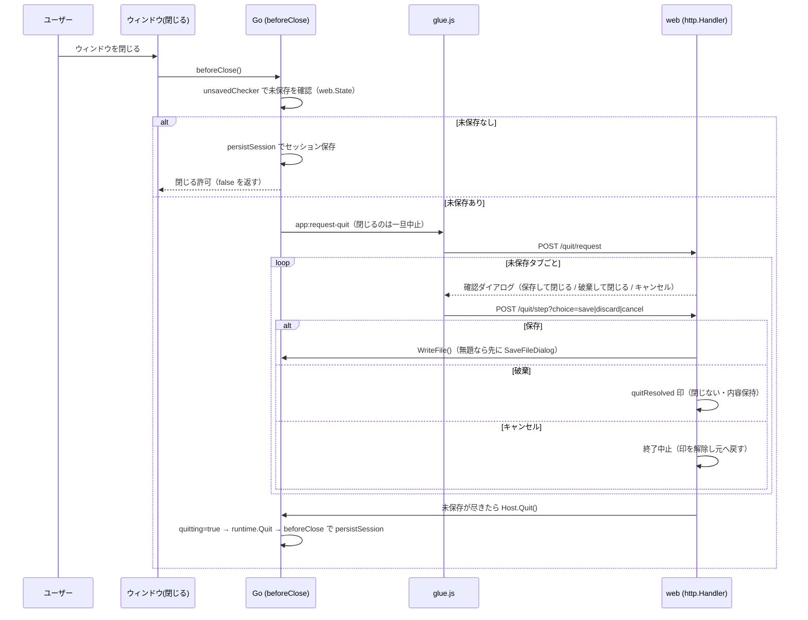
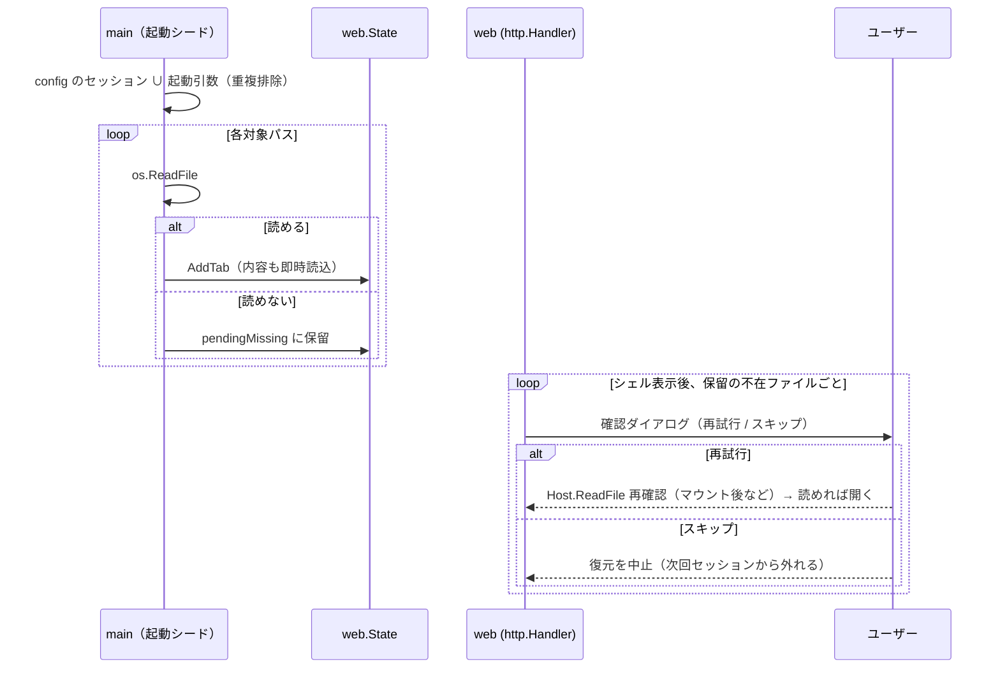

# Markmiru アーキテクチャ・画面設計

最終更新: 2026-07-03

技術スタック・要件は [`技術選定.md`](技術選定.md) を参照。本書は全体アーキテクチャと画面設計を定める。

> **実装は Go-SSR（Wails v2 ＋ Go の `html/template` ＋ htmx）**。Go を厚い層に置き、状態管理・Markdown 描画・HTML 生成・htmx エンドポイントを Go が担う。WebView 側の自作物は `glue.js` のみ（mermaid.js・htmx は既製ライブラリ）。フロントエンドのビルド工程は無い。技術選定の経緯は [`技術選定.md`](技術選定.md)／[`代替技術調査.md`](代替技術調査.md) を参照。

## 0. 確定した設計方針

| 項目 | 決定 |
|------|------|
| モード切替 | **全画面トグル**（閲覧 ⇄ 編集を丸ごと切替。閲覧重視） |
| ファイルの所在 | **複数の異なるディレクトリを横断**して読み書きする。特定フォルダ配下に限定しない |
| ファイルの開き方 | 個別に開く（ファイルダイアログ／ファイル関連付け・単一インスタンス IPC）。※ドラッグ&ドロップは未実装（将来） |
| サイドバー | **「開いている Markdown ファイルの一覧」**（フォルダツリーではない）。タブの**視認性補助**として開閉可 |
| 保存 | **手動保存（Ctrl+S）**。終了時に未保存があれば**確認ダイアログ**（保存／保存しない／キャンセル） |
| Markdown 機能 | **GFM ＋ mermaid**（標準）。数式等の拡張は段階的に追加 |
| 既定モード | 既存ファイルは**常に閲覧モード**で開く。新規作成の空ドキュメントのみ編集モード |
| セッション復元 | 起動時に前回のファイル群を**復元**（各ファイルを起動時に全件読込）。不在ファイルは**1件ずつダイアログ（再試行／スキップ）**（§5.6） |
| 外部変更監視 | **後続フェーズ**（初期リリースには含めない） |
| 生 HTML | **安全な HTML は許可**（bluemonday で危険要素のみ除去） |
| 印刷 / PDF | 印刷向け配色（紙=白・濃色文字）に変換して出力（§5.5） |
| 多重起動 | **単一インスタンス**。2 つ目の起動は既存ウィンドウへファイルを渡し前面化（§5.7） |
| 画像 | ローカルパス（相対・絶対・ルート相対）を data URI 化して表示。外部（リモート）画像は**ファイルごとに表示可否を確認**（§5.8） |
| 埋め込みドキュメント | ヘルプ→「ライセンス...」/「Markmiru について...」で同梱 `LICENSE.md` / `README.md` を**編集不可（readOnly）タブ**として表示（§5.9）。専用 About 画面は設けず README で代替 |

> **サイドバーの位置づけ**: 開いているファイルはタブと一覧の両方に現れる（ほぼ等価）。タブが増えて視認性が落ちた際に、一覧で素早く目的のファイルへ切替えるための補助 UI。異なるディレクトリの同名ファイルを区別できるよう、一覧には**親ディレクトリ等のパス情報**を併記する設計〔パス併記は**未実装**——現状はファイル名のみ表示〕。

---

## 1. 全体アーキテクチャ

Wails の構造（Go バックエンド ＋ OS 標準 WebView）に従いつつ、**Go を厚い層**に置く Go-SSR 構成。UI は Go が `html/template` で生成した HTML／HTML 断片を htmx が差し替える。

- **Go（厚い層）**: 状態管理（タブ／アクティブ／dirty／セッション／スタイル）、Markdown 描画（goldmark → chroma → bluemonday）、HTML 生成（`html/template`）、htmx エンドポイント（`http.Handler`）、任意パスのファイル I/O・ローカル画像の data URI 化、ネイティブメニュー・ネイティブダイアログ、ウィンドウ・ライフサイクル、単一インスタンス（IPC）、設定・セッションの永続化。（ファイル監視は後続フェーズ・未実装）
- **WebView（薄い表示層）**: Go 生成 HTML の表示、htmx（操作→Go へ要求→DOM 断片差し替え）、mermaid.js（図の描画のみ）、自作 `glue.js`（編集オーバーレイのスクロール同期・ページ内検索・外部リンク横取り・メニュー/IPC イベントブリッジ・ダイアログのフォーカス/キージャック対策）、CSS ＋ 同梱 Noto フォント。

htmx のリクエストは Wails の `AssetServer.Handler` が受け、プロセス内で Go の `http.Handler` を直接呼ぶ**疑似 HTTP**（TCP/ソケットなし）。ネイティブメニュー・IPC は Wails **イベント**（Go→JS）を glue が受け、`htmx.ajax()` で画面操作と同じエンドポイントに合流する。OS ダイアログ等の OS 連携は `web` ハンドラが Go 側で `Host` 経由で呼び、WebView から直接呼ぶ Wails **バインディング**（JS→Go）は `FocusWindow` のみ（§1.1）。


```mermaid
flowchart LR
  subgraph Frontend["WebView（薄い表示層）"]
    HTMX["htmx<br/>操作→要求→DOM 断片差し替え"]
    Mermaid["mermaid.js<br/>図の描画のみ"]
    Glue["glue.js<br/>スクロール同期 / 検索 / リンク / イベントブリッジ"]
    CSS["CSS + 同梱フォント<br/>(Go 出力のスタイル変数)"]
  end
  subgraph Backend["バックエンド (Go / Wails・厚い層)"]
    Web["web: http.Handler<br/>htmx エンドポイント + html/template"]
    Render["render: goldmark → chroma → bluemonday"]
    State["web.State<br/>タブ / アクティブ / dirty / セッション"]
    Style["style: スタイル定義 → CSS 変数"]
    App["app: ファイル I/O / 画像 data URI<br/>ライセンス・README (//go:embed)"]
    SI["単一インスタンス<br/>(single_instance.go + platform_*.go)"]
    Cfg["config: 設定・セッション永続化"]
    Menu["ネイティブメニュー + ダイアログ<br/>(main.go)"]
    Life["ライフサイクル<br/>(beforeClose / 終了ループ)"]
  end

  HTMX <-->|"疑似 HTTP（AssetServer.Handler）"| Web
  Web --> Render
  Web --> State
  Web --> Style
  Web --> App
  State --> Cfg
  Style --> CSS
  Render -->|"&lt;pre class=mermaid&gt;"| Mermaid
  Menu -->|"menu:* イベント"| Glue
  SI -->|"ipc:open-file / 前面化"| Glue
  Glue -->|"htmx.ajax()"| HTMX
  Life --> State
```

### 1.1 Go 側の責務（バインドメソッドと Host インタフェース）

状態管理・描画・HTML 生成は `web` パッケージ（`web.State` ＋ `http.Handler` ＋ `html/template`）。OS 連携は `app.go` のバインドメソッド（Wails runtime を持つ）で、`web` からは `web.Host` インタフェース経由で呼ぶ（`main.go` の `webHost` アダプタが橋渡し。`web`→`main` の循環を避ける）。

`web.Host`（OS 連携の呼び出し口）: `OpenFilesDialog` / `SaveFileDialog` / `WriteFile` / `ReadFile` / `ReadmeMarkdown` / `LicenseMarkdown` / `ExportStyleDialog` / `ImportStyleDialog` / `SetEditMenuEnabled` / `SetSaveMenuEnabled` / `SetModeMenuEnabled` / `Quit` / `OpenURL`。

WebView から直接呼ぶバインド（`window.go.main.App.*`）: `FocusWindow()`（アプリ内ダイアログ表示時のキーボードフォーカス付与。Windows 用、他 OS は no-op）。

| バインド/委譲メソッド | 役割 |
|----------|------|
| `OpenFiles()` | ネイティブのファイル選択（複数選択可。任意ディレクトリ）。`[]FileDoc` を返す |
| `ReadFile(path)` | 任意パスのファイル読込（`FileDoc` を返す。不在ファイルの「再試行」や IPC で使用） |
| `SaveFile(path, content)` | 任意パスへの書込（保存） |
| `SaveFileDialog(suggestedName)` | 「名前を付けて保存」先の取得 |
| `ExportStyleDialog(suggestedName)` | スタイル書き出し用の保存先取得（`*.json` フィルタ。書込は `SaveFile`） |
| `ImportStyleDialog()` | スタイル読み込み用のファイル選択（単一）。選んだファイル内容を返す |
| `ReadLicense()` / `ReadReadme()` | 同梱 `LICENSE.md` / `README.md`（`//go:embed`）の内容を返す（§5.9） |
| `LoadConfig()` | 設定の取得（`config.go`）。保存は終了時に `main` が注入したクロージャ（`persistSession`）とウィンドウ状態の `saveWindowState` が `writeConfig` 経由で行う（§7） |
| `SetEditMenuEnabled(canEdit)` / `SetSaveMenuEnabled(canSave)` / `SetModeMenuEnabled(canToggle)` | 手組み編集メニュー（Win/Linux）の編集専用項目／「保存」／「閲覧/編集切替」（全 OS）の有効・無効を切替（§9）。**サーバ主導**——`web` のミドルウェアが各 POST 後に状態から判定し、変化時だけ呼ぶ |
| `OpenExternalURL(url)` | 外部リンクを OS の既定ブラウザ／メーラで開く（§5.11） |
| `FocusWindow()` / `Quit()` | WebView にキーボードフォーカス付与 / アプリ終了。※ウィンドウの前面化は非公開の `bringToFront()`（IPC 受信時）が担当 |

Go→WebView のイベント（glue が受信）: `ipc:open-file`（後発インスタンスから転送されたファイルを開く。§5.7）、`menu:<action>`（メニュー操作。例: `menu:new` `menu:open` `menu:save` `menu:saveAs` `menu:print` `menu:style-import` `menu:style-export` `menu:settings` `menu:toggleMode` `menu:toggleSidebar` `menu:license` `menu:about`。手組み編集メニュー（Win/Linux）からは `menu:undo` `menu:redo` `menu:cut` `menu:copy` `menu:paste` `menu:selectAll` `menu:find` も。§9）、`app:request-quit`（終了要求 → glue が `POST /quit/request` で終了ループ開始。§5.3）。

> 外部変更監視（fsnotify、`WatchFile` 等）は**後続フェーズ**のため未実装（§5.4）。ディレクトリ走査やフォルダ監視も**不要**。サイドバー一覧は「開いているファイル」を `web.State` から描画するため、ファイルシステム走査を伴わない。

### 1.2 WebView 側の責務

- **htmx**: 操作（クリック等）を Go の htmx エンドポイントへ送り、返ってきた HTML 断片で該当領域（本文 `#content`／タブバー `#tabbar`／サイドバー／設定／`#dialog-host` 等）を差し替える。
- **glue.js（唯一の自作 JS）**: 編集オーバーレイのスクロール同期、**保存前の未送信編集の flush**（`menu:save`/`menu:saveAs` 受信時と Ctrl+S フォールバック時に、150ms デバウンス待ちの textarea 内容を先にサーバへ同期してから保存を叩く。§5.2）、ページ内検索（CSS Custom Highlight API・§5.12）、外部リンク横取り（§5.11）、ネイティブメニュー/IPC イベント → `htmx.ajax()` ブリッジ、ダイアログのフォーカス付与・Esc=拒否・危険側の 500ms 無効化、設定パネルの対入力（スライダー↔数値／カラー↔HEX）同期、印刷トリガ。
- **mermaid.js**: `<pre class="mermaid">` を図として描画（`securityLevel:'strict'`。テーマは本文の `data-scheme` に連動）。
- **CSS ＋ 同梱フォント**: Go が出力するスタイル変数（`--md-*`）＋ ベース CSS ＋ Noto woff2（`@font-face`）。

---

## 2. データモデル（サーバ状態）

状態は Go の `web.State`（`web/state.go`）が保持する（`Tab` 構造体＋タブ集合）。フロントは状態を持たず、Go が描画した HTML を表示するだけ。

```text
Tab {
  ID                string   // 内部 ID
  FilePath          string   // 任意ディレクトリの絶対パス。"" = 無題（新規）
  FileName          string   // 表示名（例: a.md）
  Content           string   // 現在の編集内容
  SavedContent      string   // 最後に保存した内容（dirty 判定用）
  Edited            bool     // 一度でも編集されたか（元に戻しても未保存扱い）
  Mode              string   // "view" | "source"。既定は "view"
  ReadOnly          bool     // 編集不可タブ（例: ライセンス表示）。編集モード・保存を無効化
  RemoteImagePolicy string   // "" 未確認 / "allow" / "block"（外部画像。§5.8）
  quitResolved      bool     // 終了ループで「破棄」を選んだ印（非永続）
}
// dirty はフィールドではなく dirty() = Edited || Content != SavedContent で派生。

State {
  tabs / activeID           // 開いているファイル群（タブ／サイドバー一覧の共通ソース）
  styles / activeStyleID    // プリセット＋ユーザースタイル、アクティブ
  sidebarOpen / settingsOpen
  pendingMissing []string   // 起動時に開けなかったパス（再試行/スキップ。§5.6）
  pendingLinkURL string     // 外部リンク確認ダイアログの対象 URL（§5.11）
}
```

- タブとサイドバー一覧は**同じ `tabs` を参照**する（二重管理しない）。サイドバーは同名ファイル区別のためパス情報を併記する。
- **dirty はサーバが保持**する。編集入力（`POST /tabs/{id}/content`）の応答でタブバーを OOB 更新し、未保存マーク（•）を即時反映する。
- `ReadOnly` タブ（ライセンス等）は `FilePath=""` で開き、セッションには保存しない（§5.9）。

---

## 3. Markdown レンダリングパイプライン（閲覧モード）

描画は Go（`render` パッケージ）が一括で行う。

```text
ソース文字列
  └─ goldmark（CommonMark ＋ GFM: 表 / チェックリスト / 打消し線 / 自動リンク ＋ 脚注）
        ├─ コードフェンス ```lang    → chroma で色付け HTML（クラス方式）
        └─ コードフェンス ```mermaid → <pre class="mermaid"> プレースホルダとして出力
  └─ bluemonday でサニタイズ（許可タグ・属性のみ。script 等の危険要素を除去。外部リンクへ rel 付与）
  └─ html/template で本文断片へ埋め込み、htmx が #content へ差し替え
  └─ WebView の mermaid.run() が <pre class="mermaid"> を SVG 描画
```

- **mermaid**: ` ```mermaid ` フェンスを `<pre class="mermaid">` として出力し、htmx の差し替え後に glue が `mermaid.run()` で描画（`securityLevel:'strict'`）。テーマは本文ラッパの `data-scheme` に連動し、再描画する。
- **サニタイズ**: goldmark 出力を bluemonday の許可リストで無害化（chroma のコードは許可クラスを通す）。mermaid の SVG はサニタイズ対象外（WebView 側で描画）。
- **再描画**: 編集入力はデバウンスして `POST /tabs/{id}/content`（ハイライト層のみ再描画）。閲覧モードへ切替時は最新内容で本文を描画。
- **画像**: ローカル画像は Go（`render`）が data URI 化、外部（リモート）画像はファイルごとに表示確認、文書と別ホストを指す UNC 画像は確認を出さず常に遮断（§5.8）。
- **外部リンク**: クリック時に glue が横取りして確認ダイアログ（§5.11）を挟み、許可されたら `OpenExternalURL`（`BrowserOpenURL`）で OS ブラウザへ委譲。全レスポンスに CSP（`script-src 'self' 'unsafe-eval'` 等。`unsafe-eval` は mermaid の Function 生成に必要）をミドルウェアで注入。

---

## 4. 画面設計

### 4.1 ウィンドウ全体（閲覧モード・サイドバー開）

サイドバーは「開いているファイル一覧」。各項目に**ファイル名＋パス情報**と未保存マーク（`*`）を表示し、クリックで該当タブへ切替える。

```text
┌─────────────────────────────────────────────┐
│ ネイティブメニュー（ファイル / 編集 / 表示 / ヘルプ）      │
├──────────────┬──────────────────────────────┤
│ 開いているﾌｧｲﾙ │ [☰] [a.md] [b.md*] [c.md] … [+] │ ← タブバー
│ ──────────── ├──────────────────────────────┤
│▶ a.md         │                              │
│   ~/proj      │                              │
│  b.md  *      │                              │
│   ~/docs      │      レンダリング表示          │
│  c.md         │      （閲覧モード）            │
│   ~/notes     │                              │
│              ├──────────────────────────────┤
│              │ 文字数:1234   UTF-8   ● 保存済  │ ← ステータスバー
└──────────────┴──────────────────────────────┘
```

- `▶` は選択中（アクティブ）のファイル。`*` は未保存。
- 同名ファイルでも `~/proj` `~/docs` 等のパス併記で区別できる〔図は設計案。パス併記は**未実装**——現状はファイル名のみ〕。
- サイドバーは開閉可（`Ctrl+B`、タブバー左端の `☰`）。閉じるとコンテンツが全幅になる。タブが少なければ閉じたままでも支障ない。
- タブバーに機能ボタン（開く/モード切替/保存/設定/About/ライセンス）は置かない。すべて**ネイティブメニュー**から呼び出す（§9）。

### 4.2 編集モード（サイドバー閉）

```text
┌─────────────────────────────────────────────┐
│ ネイティブメニュー                              │
├─────────────────────────────────────────────┤
│ [☰] [a.md] [b.md*]                        [+] │
├─────────────────────────────────────────────┤
│ # 見出し                                      │
│                                              │ ← 透明 textarea ＋
│ ```mermaid                                   │   chroma ハイライト層の
│ graph TD; A-->B;                             │   オーバーレイ（§6・下記）
│ ```                                          │
├─────────────────────────────────────────────┤
│ 行:3 列:5   文字数:1234   UTF-8   ● 未保存      │
└─────────────────────────────────────────────┘
```

### 4.3 画面の構成（Go-SSR シェルとテンプレート）

UI は Go の HTML テンプレート（`web/templates/`）で生成し、htmx が領域ごとに差し替える。シェル（`shell.html`）の主なリージョンと、差し替え対象の断片（`fragments.html`）は次のとおり。

```text
#app[data-scheme]
├─ #tabbar        … タブバー（tabbar-inner: サイドバートグル/タブ一覧/新規。機能ボタンは置かずメニューから呼び出す）
├─ .body-row
│  ├─ #sidebar    … 開いているファイル一覧（sidebar-inner。tabs から描画・開閉）
│  └─ #content    … 本文（content: 閲覧=preview / 編集=textarea オーバーレイ）
├─ #settings      … スタイル設定モーダル（settings-modal。常時レンダリング＋[hidden] で表示制御）
├─ #dialog-host   … 確認ダイアログの差し込み先（remote/close-unsaved/quit/link/missing-file）
├─ #ctxmenu-host  … 予約（右クリックメニューは未実装。§5.10）
└─ #find-host     … ページ内検索バーの差し込み先（§5.12）
```

- **本文（content）**: 閲覧は `.preview-scroll > .markdown-body`（Go 生成の安全な HTML）、編集は透明 `<textarea>` ＋ chroma ハイライト層のオーバーレイ（§6）。
- **ダイアログ**: いずれもサーバが `html/template` で描画して `#dialog-host`（または `#settings`）へ htmx で差し込む。共通の見た目（`.mm-backdrop` / `.mm-dialog`）と、glue の共通制御（フォーカス付与・Esc=拒否・Enter=既定ボタン・危険側の 500ms 無効化）を再利用する。
- 唯一の自作 JS は `web/assets/glue.js`。テンプレートは `shell.html`（シェル）と `fragments.html`（断片）。

> 専用の `StatusBar`（§4.1 / §4.2 のステータスバー）は未実装（将来案）。

### 4.4 htmx エンドポイント一覧（実装）

`web.NewHandler`（`http.Handler`）が返す htmx エンドポイント。すべて Wails の `AssetServer.Handler` 経由の疑似 HTTP（§1）で、全レスポンスに CSP ヘッダを付与する（`withCSP` ミドルウェア）。ネイティブメニュー／IPC は Wails イベント → glue が下表の同じエンドポイントを叩いて合流する。応答の多くは `nav`（本文＋タブバー/サイドバー/`#dialog-host` を OOB 更新）。

| メソッド / パス | 役割 | 返す / 差し替え先 |
|---|---|---|
| `GET /` | アプリシェル（状態から描画） | 全体 HTML |
| `GET /assets/…` | 同梱静的アセット（htmx / mermaid / glue.js / CSS / フォント woff2） | 静的ファイル |
| `GET /tabs/{id}/view` | 指定タブの閲覧断片 | 本文＋`#dialog-host` OOB |
| `POST /tabs/new` | 新規タブ（無題・編集モード） | nav |
| `POST /tabs/open` | OS ダイアログでファイルを開く | nav |
| `POST /tabs/open-path` | パス指定で開く（IPC／ファイル関連付け。既存は再アクティブ化） | nav |
| `POST /tabs/{id}/activate` | タブ切替 | nav |
| `POST /tabs/{id}/close` | タブを閉じる（未保存は3択。`?choice=save\|discard\|cancel`） | nav or ダイアログ（`HX-Retarget: #dialog-host`）。cancel・保存先選択キャンセル時＝navkeep |
| `POST /tabs/{id}/mode` ／ `POST /active/mode` | 閲覧/編集 切替（指定／アクティブ） | nav |
| `POST /tabs/{id}/content` | 編集中の本文更新＋再ハイライト | ハイライト層の**中身のみ**（`#hl-{id}` へ innerHTML。`<pre>` 要素は差し替えず、スクロール位置は原則ブラウザが保持。行数が増える編集で同期がクランプされた場合のみ glue が afterSwap で再同期）＋タブバー OOB（未保存マーク） |
| `POST /tabs/{id}/save`・`/save-as` ／ `POST /active/save`・`/save-as` | 保存（無題は OS 保存ダイアログ。**未変更タブへの「保存」は書き込まない**＝§5.2） | 原則 navkeep（`HX-Reswap: none`。本文は差し替えずタブバー/サイドバー/ダイアログ host のみ OOB＝スクロール位置・キャレット保持、ダイアログは閉じる）。保存先が決まった/変わり、かつ閲覧モードで表示中のアクティブタブのとき＝nav（BaseDir が変わるため本文再描画） |
| `POST /active/print` | 印刷（アクティブを閲覧に強制） | nav（`HX-Trigger-After-Settle: do-print`） |
| `POST /tabs/{id}/remote-images?choice=allow\|block` | 外部画像の表示可否（§5.8） | 本文＋`#dialog-host` OOB |
| `POST /sidebar/toggle` | サイドバー開閉 | `#sidebar` |
| `POST /settings/toggle` | 設定モーダル開閉 | `#settings` |
| `POST /settings/style`（`value`=スタイルID） ／ `/duplicate` ／ `/delete` | スタイル選択（プルダウン）／複製／削除（パネル最下部の危険ボタン） | restyle（本文＋OOB） |
| `POST /settings/field/{key}` ／ `/heading/{n}/{key}` | スタイル1フィールド編集（ライブプレビュー） | `#styleblock`（色スキーム等は restyle、customCSS は `#customcss`） |
| `POST /settings/rename` ／ `/export` ／ `/import` | 改名／エクスポート／インポート | `#settings` or 本文 |
| `POST /find/open` | ページ内検索バーを開く（走査・ハイライトは glue。§5.12） | `#find-host` |
| `POST /link/confirm` ／ `/open` ／ `/dismiss` | 外部リンク確認 →`Host.OpenURL`（§5.11） | `#dialog-host`（OOB クリア） |
| `POST /missing/retry` ／ `/skip` | 不在ファイルの再試行／スキップ（§5.6） | nav（＋次の確認） |
| `POST /quit/request` ／ `/quit/step` | 終了ループ（未保存を順に確認 →`Host.Quit`。§5.3） | ダイアログ or nav。cancel・保存先選択キャンセル時＝navkeep |
| `POST /doc/about` ／ `/doc/license` | 同梱 README／LICENSE を読み取り専用タブで開く（§5.9） | nav |

---

## 5. 主要フロー

### 5.1 ファイルを開く（複数ディレクトリ横断）

1. メニュー「開く」（複数選択可・`POST /tabs/open`）／OS のファイル関連付け・単一インスタンス IPC（`POST /tabs/open-path`）。（ドラッグ&ドロップは未実装）
2. 内容取得: 「開く」は `OpenFilesDialog` が選択ファイルを読み込んで返す。関連付け／IPC は `Host.ReadFile(path)` で読む（パスは任意ディレクトリ）。
3. 新規タブを追加（**既定 `mode='view'`**、`savedContent=content`）。関連付け／IPC 経由（`open-path`）は**既に同じ `FilePath` のタブがあれば再アクティブ化**する。一方メニュー「開く」は毎回新規タブを追加する（同一ファイルの重複は排除しない）。画像解決の基点ディレクトリは `FilePath` から派生（`dir()`）。
4. タブとサイドバー一覧の双方に反映（同一 `tabs` を参照）。

> **既定モード**: 既存ファイルは**常に閲覧モード**で開く。**新規作成の空ドキュメントのみ**、編集が目的のため**編集モード**で開く。
> **外部変更監視**（`WatchFile`）は後続フェーズのため初期リリースには含めない（§5.4）。

### 5.2 保存（Ctrl+S）

0. **保存前の flush（クライアント）**: `menu:save` / `menu:saveAs` / Ctrl+S フォールバックを受けた glue は、編集中 textarea の**未送信内容（150ms デバウンス待ち）を先に `POST /tabs/{id}/content` で同期してから**保存エンドポイントを叩く。これにより「入力直後の Ctrl+S」が古い内容の保存や no-op 空振りにならない。なお「保存」メニューが無効（サーバがクリーン認識）の間はネイティブアクセラレータが発火せずキーが WebView に届くため、glue の keydown が Ctrl+S を拾って同じフローへ流す（有効時はネイティブ側が先に消費）。
1. **未変更（dirty でない）タブへの「保存」はファイルへ書き込まない**（完全 no-op）。外部変更監視が無いため、他エディタでの編集を開いた時点の古い内容で上書きする事故を防ぐ（VS Code / Emacs と同方式）。「名前を付けて保存」と無題の初回保存は対象外（常に書き込む）。**閉じる/終了ダイアログの「保存して閉じる」経路（`saveTabForClose`）も同じ規律**（clean なら書き込まずに閉じる）。
2. `FilePath` が空（`""`＝無題）なら Go `SaveFileDialog` で保存先取得（任意ディレクトリ）。
3. Go `SaveFile(path, content)`（`FileDoc` を返す）。書き込みは共通コア `writeTab` 経由。
4. `savedContent` は**実際に書き込んだスナップショット**とし、タブ／一覧の `*`（未保存マーク）を消す。**書き込み I/O 中にさらに編集が届いた場合は dirty のまま残す**（現在値を保存済み扱いにすると、未書き込みの編集が clean 誤認され再保存も終了確認もされずに消えるため）。
5. `readOnly` タブ（ライセンス等）では保存系の操作は無効。
6. **表示位置の保持**: 上書き保存（保存先が変わらない保存・未変更 no-op・キャンセル含む）は本文（`#content`）を差し替えず（`HX-Reswap: none` の navkeep 応答）、閲覧のスクロール位置・編集キャレットをそのまま保つ。保存先が決まった/変わったとき（無題の初回保存・名前を付けて保存）も、再描画するのは**閲覧モードで表示中のアクティブタブのみ**（画像解決の基点 BaseDir が変わるため）。編集モードは BaseDir と無関係なので再描画せずキャレットを保つ。
7. **ダイアログとの整合**: navkeep 応答はダイアログ host も OOB で更新する（Dialog=nil＝閉じる）ため、確認ダイアログ表示中に Ctrl+S で保存した場合も、前提が消えた「未保存の変更があります」ダイアログが残らない。

### 5.3 終了時の未保存確認

ウィンドウの閉じる操作は Go の `beforeClose` が捕捉する。未保存の有無は**サーバ状態**（`web.State.HasUnsaved`、`main` が `unsavedChecker` として注入）で判定する。未保存があれば一旦閉じるのを止め、`app:request-quit` を発火。glue が `POST /quit/request` を叩き、**サーバが終了ループを主導**する——未保存タブを1つずつ確認ダイアログ（保存して閉じる／破棄して閉じる／キャンセル）で処理し、`POST /quit/step` で次へ進む。未保存が尽きたら `Host.Quit()`。終了ループでは対象タブを閉じずに解決する（保存＝clean 化、破棄＝`quitResolved` 印）ため、途中でキャンセルすれば全タブが元の未保存状態に戻る。セッション（開いていたファイル・スタイル・サイドバー）は `beforeClose` の閉じる許可経路で `persistSession` が config に保存する。


```mermaid
sequenceDiagram
  participant U as ユーザー
  participant W as ウィンドウ(閉じる)
  participant Go as Go (beforeClose)
  participant Glue as glue.js
  participant Web as web (http.Handler)

  U->>W: ウィンドウを閉じる
  W->>Go: beforeClose()
  Go->>Go: unsavedChecker で未保存を確認（web.State）
  alt 未保存なし
    Go->>Go: persistSession でセッション保存
    Go-->>W: 閉じる許可（false を返す）
  else 未保存あり
    Go->>Glue: app:request-quit（閉じるのは一旦中止）
    Glue->>Web: POST /quit/request
    loop 未保存タブごと
      Web-->>Glue: 確認ダイアログ（保存して閉じる / 破棄して閉じる / キャンセル）
      Glue->>Web: POST /quit/step?choice=save|discard|cancel
      alt 保存
        Web->>Go: WriteFile()（無題なら先に SaveFileDialog）
      else 破棄
        Web->>Web: quitResolved 印（閉じない・内容保持）
      else キャンセル
        Web->>Web: 終了中止（印を解除し元へ戻す）
      end
    end
    Web->>Go: 未保存が尽きたら Host.Quit()
    Go->>Go: quitting=true → runtime.Quit → beforeClose で persistSession
  end
```

### 5.4 外部変更の検知（後続フェーズ）

> **初期リリースには含めない。** 後続フェーズで追加予定。

（将来案）Go の fsnotify が変更を検知し、当該タブが未保存でなければ自動再読込、未保存なら競合の確認を表示する（htmx で本文/ダイアログを差し替え）。

### 5.5 PDF 出力 / 印刷

OS / WebView の印刷機能＋**印刷用 CSS（`@media print`）** を用い、OS の「PDF として保存」で出力する（外部依存なし・クロスプラットフォーム）。印刷の起動は Go バインドの `Print` に委譲する: macOS は自前の `NSPrintOperation`（`platform_darwin.go` の cgo）でネイティブ印刷パネルを開き（WKWebView は `window.print()` を無視し、Wails `WindowPrint` は横向き固定でパネルに向きの選択肢が出ないため）、縦向きをデフォルトに向き・用紙サイズ・拡大縮小をパネルで変更可能にし、用紙余白を Windows/Linux の既定と同等（約 1cm）にする（WKWebView を特定できない場合のみ Wails `WindowPrint` へフォールバック）。Windows/Linux は Wails `WindowPrint` 経由で WebView 内の `window.print()` を実行する（従来から縦デフォルト・向き変更可）。

- **配色は印刷向けに変換**（紙=白背景・濃色文字）。組版（フォント/サイズ/余白）はアクティブなスタイルを継承する。
- 詳細は [`スタイル設定設計.md`](スタイル設定設計.md) §5.2 を参照。

※ 将来、Windows の WebView2 `PrintToPdf` 等による無確認エクスポートを追加検討。

### 5.6 起動時のセッション復元

前回開いていた**ファイル群（パス一覧）を起動時に再オープン**する。終了時の未保存確認（§5.3）により、復元対象は**保存済みでパスを持つファイル**のみ（未保存バッファの保持は不要）。実装は `main` の起動シード（config → `web.State`）。

- **開く対象**: 前回セッション ∪ 起動引数（重複排除）。起動引数（ファイル関連付け等）で指定したファイルは前回セッションと**マージ**され、最後がアクティブになる。各ファイルは起動時に**全件、内容まで読み込んで**タブを開く。
- **不在ファイルの扱い**: パスが存在しない場合、`web.State` に保留（`pendingMissing`）し、シェル表示時に**1件ごとの確認ダイアログ**（`POST /missing/retry` / `/missing/skip`）を表示する。
  - **再試行**: `Host.ReadFile` で存在を再確認（ファイルサーバーのマウント忘れ等を想定）。読めれば開き、まだ無ければ再度ダイアログ。
  - **スキップ**: そのファイルの復元を諦める（次回保存されるセッションからは外れる）。
- **クラッシュ（異常終了）時**の未保存内容は失われる（自動保存はしない方針のため）。設定・セッションの保存は**終了時**（`beforeClose`）に行うため、強制終了時はその回の変更が保存されない。クラッシュ復旧は将来課題。


```mermaid
sequenceDiagram
  participant Main as main（起動シード）
  participant St as web.State
  participant Web as web (http.Handler)
  participant U as ユーザー

  Main->>Main: config のセッション ∪ 起動引数（重複排除）
  loop 各対象パス
    Main->>Main: os.ReadFile
    alt 読める
      Main->>St: AddTab（内容も即時読込）
    else 読めない
      Main->>St: pendingMissing に保留
    end
  end
  loop シェル表示後、保留の不在ファイルごと
    Web->>U: 確認ダイアログ（再試行 / スキップ）
    alt 再試行
      U-->>Web: Host.ReadFile 再確認（マウント後など）→ 読めれば開く
    else スキップ
      U-->>Web: 復元を中止（次回セッションから外れる）
    end
  end
```

### 5.7 単一インスタンス（多重起動防止）

2 重起動を防ぎ、2 つ目以降の起動は**既存ウィンドウへファイルを渡して前面化**する（実装: `single_instance.go`（共通）＋`platform_*.go`（OS 固有）、起動引数の受け渡しは `app.go`）。

- **ロック兼 IPC チャネル**: ユーザー固有ディレクトリ（`os.UserCacheDir`）内のソケットで `ensureSingleInstance()` を行う。リスナーを起動できれば先発、既存があれば後発と判定。
- **後発インスタンス**: 開こうとしたファイルパスを IPC で先発へ送信し、**先発が接続を閉じる（＝処理完了）のを待ってから**終了（`os.Exit`）する（上限 2 秒）。即時 exit すると Linux のピア検証（`/proc/<pid>/exe` 照合）の時点で自プロセスが消えており受け渡しが破棄されるため。ペイロードはパス数・長さに上限を設けて検証する。
- **先発インスタンス**: 受信パスを `ipc:open-file` イベントで WebView へ渡し（glue が `POST /tabs/open-path`。既に開いていれば再アクティブ化）、ウィンドウを前面化（OS 依存のフォアグラウンド処理）。
- **起動時の引数**: 起動引数は `main` の起動シードで前回セッションとマージして開く（§5.6）。以後の IPC はイベントで即時配信する。
- プラットフォーム別の OS 固有ネイティブ補助（IPC ピア検証・ウィンドウ前面化・WebView フォーカス）: `platform_{windows,darwin,linux,other}.go`。

### 5.8 画像の表示（ローカル / 外部）

信頼できない Markdown を安全に扱うため、画像はソース種別で扱いを分ける（実装: `render` パッケージ）。

- **ローカル画像**（相対・絶対・ルート相対パス）: Go（`render`）が読み込んで **data URI 化**して埋め込む。基点は当該ファイルのディレクトリ。読み取り自体はログオンユーザー権限の範囲であり許容（内容は data URI としてインライン化されるだけで外部送出は伴わない）。
- **外部（リモート）画像**（`http`/`https`/プロトコル相対 `//`）: 既定では**遮断**してレンダリングし、**ファイルごとに表示可否を確認**する。確認ダイアログはサーバが `#dialog-host` へ描画し、危険側「表示する」は glue が 500ms 無効化＋Enter 無効（§5.11）、安全側「表示しない」は Esc 対応。結果は `Tab.RemoteImagePolicy`（`allow` / `block`）として保持するが、**セッションには永続化しない**（次回起動時に再確認）。判定は `src` に加え **`srcset` の全候補**を走査し（先頭候補だけを見る回避を防ぐ）、先頭空白による判定回避も正規化して防ぐ。
- **クロスホスト UNC 画像**（`\\別ホスト\…`。文書の置かれたサーバとは**異なるホスト**を指す UNC）: **表示確認を出さず常に遮断**し、読み込まない。Windows では別サーバへの SMB 接続が自動 NTLM 認証を伴い**認証情報（NetNTLMv2 ハッシュ）が外部へ漏洩する**ため、「表示しますか？」で選ばせてよい種類の操作ではない、という判断。**同一ホスト UNC**（文書と同じサーバ上の画像。ファイルサーバー上に置いた文書＋相対画像の正規シナリオ）はローカル同様に読み込む。判定は decode 後に行い、percent-encode 版 UNC（`%5C%5C…`）も遮断する。実装は `render.isCrossHostUNC` で、読み取りの実体 `imageToDataURI` でも多層防御として同じ判定を行う。
  - 正規の利用で「ローカル文書から別サーバの画像を UNC 直書きで参照」したい稀なケースは、**相対パス化**・**ドライブレター付き絶対パス化**（`Z:\…` のようにネットワークドライブ割り当ては UNC 文字列ではないため対象外）で対応できる。

### 5.9 埋め込みドキュメント表示（ライセンス / About）

ヘルプメニューから、実行バイナリに埋め込んだドキュメントを**編集不可タブ**として表示する。専用の About 画面は設けず、README をその代替とする。

- **ライセンス**: 「ライセンス...」（`menu:license` → glue → `POST /doc/license`）→ `LICENSE.md`（Markmiru 本体＋サードパーティを統合）を `//go:embed` で埋め込み、`Host.LicenseMarkdown()` で取得。
- **About（README）**: 「Markmiru について...」（`menu:about` → `POST /doc/about`）→ `README.md` を `//go:embed` で埋め込み、`Host.ReadmeMarkdown()` で取得。先頭に**バージョン（git ショート SHA）**を表示する（ldflags `-X main.version` で埋め込み。素のビルドでは `dev`）。OS のプロパティにも同じ版を埋め込む（AGENTS.md「バージョン番号」参照）。
- いずれも別ファイルの配置は不要。`web.State.OpenDoc()` が `ReadOnly=true` のタブで開く（`FilePath=""`。一覧にパスは出ず、セッションにも保存されない）。既に開いていればそのタブをアクティブ化する。
- `readOnly` タブは編集モードへ切替えられず、保存系の操作も無効（§2、§5.2）。

### 5.10 コピー／貼り付け・全選択（メニューとキーボード）

編集操作はネイティブメニュー（§9）とキーボード、および glue で提供する。**自前の右クリックコンテキストメニューは Go-SSR では未実装**（`#ctxmenu-host` は予約）。

- **編集操作の実行**: ネイティブ編集メニュー（Win/Linux は手組み・§9）の `menu:undo|redo|cut|copy|paste|selectAll` を glue が受け、`document.execCommand`（貼り付け等）または textarea 操作で実行する。クリップボードは WebView 標準（Ctrl+C/V/X）と共有。
- **全選択（Ctrl+A / メニュー「すべて選択」）**: glue が入力欄の外でも本文に限定して全選択する——閲覧は本文（`.markdown-body`）、編集は textarea——ことでウィンドウ全体の選択を防ぐ。閲覧モードの「コピー」は現在の選択をコピーする。
- **検索（Ctrl+F / メニュー「検索...」）**: 両モードとも glue のページ内検索（§5.12）を開く。
- 編集専用項目（取り消し/やり直し/切り取り/貼り付け）は閲覧モードで非活性（サーバ主導。§9）。

### 5.11 危険な選択を伴う確認ダイアログ（共通）

外部アプリ起動・外部通信など**ユーザーにリスクのある選択**を伴う確認は、サーバが `#dialog-host` へ描画する確認ダイアログ（`.mm-dialog`）で行い、防御は glue の共通制御で担う。**Chromium のガイドライン**（Security Considerations for Browser UI）に倣う。

- **危険側ボタンは `data-dialog-accept`**: サーバ HTML で `disabled` 済み。glue が**表示から約 500ms 後に有効化**する（**clickjacking 対策**＝起動遅延）。既定ボタン（Enter）にはしないため、Enter では発動しない（**keyjacking 対策**）。
- **安全側ボタンは `data-dialog-reject`**（Esc で実行）。安全な既定動作は `data-dialog-default`（Enter で実行）。初期フォーカスはダイアログ枠に置く。
- Windows では表示時に `FocusWindow()` で WebView にキーボードフォーカスを与える。

利用箇所（サーバ描画ダイアログ＋対応エンドポイント）:

- **外部リンクを開く**（閲覧モード）: glue が `http(s)` / `mailto` のクリックを capture フェーズで横取りし、`POST /link/confirm` で確認ダイアログを出す。「はい」（危険側・500ms 遅延）→ `POST /link/open` → `Host.OpenURL`（`BrowserOpenURL`）で OS の既定アプリへ。スキームはサーバでも再検証する。ページ内アンカー（`#...`）は glue が見出しへスクロール、未知スキーム・相対はブロック（`links` 相当を glue で再現）。
- **外部画像の読み込み**（§5.8）: 外部画像を含むファイルでファイルごとに確認（`dialog-remote`）。「表示する」（危険側）／「表示しない」。
- **未保存タブのクローズ／終了**（§5.3）: 破棄が危険側。「保存して閉じる」（既定・Enter）／「破棄して閉じる」（500ms 遅延）／「キャンセル」（Esc）。

### 5.12 ページ内検索

両モードとも **Ctrl+F / Cmd+F とメニュー「検索...」（Windows/Linux。macOS はネイティブ編集メニューのため Cmd+F のみ）**から起動できる（埋め込み WebView にはブラウザ標準のページ内検索 UI が無いため自前で用意する）。閲覧・編集の**両モードを glue の一本の共通ルーチン**で実装する。

- **検索バー**: サーバ断片（`POST /find/open`）を `#find-host` に注入。本文右上に浮かせる（本文はずれない）。入力欄・一致件数「現在/総数」・前へ/次へ（Enter＝次、Shift+Enter＝前）・閉じる（Esc / ✕）。大文字小文字は区別しない・インクリメンタル・循環ナビ。
- **検索・ハイライト（glue）**: 可視テキスト層を走査し **CSS Custom Highlight API** で強調（DOM を書き換えない）。対象は表示中のモードで切替える——**閲覧＝`.markdown-body`／編集＝`.hl` オーバーレイ**。`style`/`script` 内のテキスト（mermaid が SVG に注入する `<style>` の CSS 等）は不可視のため走査から除外する。全一致は淡色、現在の一致は濃色。現在位置へスクロール（編集モードは `.hl` と textarea を同期）。
- 起動は glue の Ctrl+F/Cmd+F 捕捉と `menu:find`。本文の再描画時は Range が無効になるため、検索中なら作り直す。

---

## 6. スタイル（SHOULD）

閲覧モードのスタイルは**構造化スタイル(JSON) ＋ CSS 変数**で表現し、細かなパラメータ調整とクロスプラットフォーム同一表示を両立する。詳細は [`スタイル設定設計.md`](スタイル設定設計.md) を参照。要点:

- 本文・見出し(h1〜h6)・コード・引用・リスト・表など**Markdown 表示の各パラメータを細かく調整**可能（CSS 変数に対応）。
- **同梱フォント**で OS 間の表示一致を担保（システムフォントも選択可。選択時は差異が出る旨を明示）。
- 編集は **GUI 設定パネル ＋ カスタム CSS** の2層。適用は**グローバル**（アクティブな1スタイルを全ドキュメントへ）。
- Light / Dark はスタイル内の配色プリセット。コード／mermaid テーマも `colorScheme` に連動。
- スタイルは保存・複製が可能。PDF 出力も同じスタイルから生成。**ファイルへのエクスポート/インポートにも対応**（メニュー「ファイル → スタイル」。[`スタイル設定設計.md`](スタイル設定設計.md) §6）。

---

## 7. 設定の永続化

OS の設定ディレクトリ（Go: `os.UserConfigDir` → `Markmiru/config.json`）に保存（実装: `config.go` の `Config`）。

- **セッション復元用情報**: 前回開いていたファイルのパス一覧（`session.files`）・アクティブ位置（`activeIndex`）（§5.6 で復元）。
- **サイドバー開閉状態**（`sidebarOpen`）。
- **スタイル**: ユーザー定義スタイル群（`style.Style`）を JSON 配列文字列で保持（`stylesJson`）＋アクティブスタイル ID（`activeStyleId`）。テーマ（Light/Dark）はアクティブスタイルの `colorScheme` に含まれる。`style.Style` の JSON タグは移行前の旧版 config と互換（過去の設定を引き継げる）だが、型定義は Go 側（`style` パッケージ）が正となる。
- **保存の契機**: セッション・サイドバー・スタイルは**終了時**に `main` が注入した `persistSession` クロージャ（`web.State` → config）が書き込む。復元は起動シード（`RestoreStylesJSON` / `SetSidebarOpen` / セッション）。
- **ウィンドウ状態**: サイズ（`windowWidth` / `windowHeight`）と最大化状態（`windowMaximised`）。起動時に `main.go` が読み込み `options.App` の `Width`/`Height`/`WindowStartState` に反映する。さらに `startup` の `restoreWindowSize()` が `runtime.WindowSetSize` でサイズを再設定する——`options.Width/Height` 経由のみだと macOS で開閉のたびにタイトルバー分だけウィンドウが肥大化するため、保存（`WindowGetSize`）と対称な `WindowSetSize` 経路で復元する（コミット 762281b）。保存は `beforeClose` → `saveWindowState` で、最大化中は通常サイズ（復元サイズ）を上書きしない。`persistSession` はセッション/スタイル/サイドバーのみを書き、ウィンドウ状態は `saveWindowState` が別途保持する。
- 最近開いたファイル履歴（セッションとは別の履歴）は**未保存**（将来拡張）。

---

## 8. プロジェクト構成（実装）

Go はルート直下に薄く配置（`internal/` は設けていない）。UI は `web` パッケージ（`http.Handler` ＋ `html/template` ＋ 静的アセット）。ビルドすべきフロントエンドは無く、`wails build` はフロントのビルドを行わず Go のみでビルドする（`frontend/wailsjs` は `wails build` が再生成するバインディングで、`.gitignore` により git 管理外）。

```text
Markmiru/
├─ wails.json                     # Wails 設定（frontend フックなし）。info.productVersion(版)・postBuildHooks(darwin/* で .app アイコン上書き)
├─ go.mod
├─ scripts/                       # ビルドスクリプト（git ショート SHA を版として埋め込む・Go のみ）
│  ├─ build.ps1                   # Windows（動作確認済み）
│  ├─ build.sh                    # macOS/Linux（両 OS とも実機検証済み）
│  └─ vendor-fonts.sh             # Noto フォントの再 vendoring（@fontsource から。通常ビルドには不要）
├─ main.go                       # Wails 起動・ネイティブメニュー・ライフサイクル・起動シード・webHost・version
├─ app.go                        # App: OS 連携バインド（ファイル I/O・ダイアログ・BrowserOpenURL 等）・ライフサイクル
├─ config.go                     # 設定・セッションの永続化（LoadConfig / writeConfig）
├─ single_instance.go            # 単一インスタンス（共通: ソケット/IPC）
├─ platform_{windows,darwin,linux,other}.go  # OS 固有ネイティブ補助（IPC ピア検証・前面化・WebView フォーカス・Linux の .desktop/アイコン自動登録）
├─ render/                       # 描画パイプライン: goldmark → chroma → bluemonday（+ 画像 data URI 化）
├─ style/                        # スタイル定義（Go 型）→ CSS 変数生成・プリセット・入出力
├─ web/                          # Go-SSR: http.Handler + html/template + 状態 + 静的アセット
│  ├─ web.go                     # ルータ・ハンドラ・ビューモデル・Host インタフェース・CSP ミドルウェア
│  ├─ state.go                   # web.State（タブ/アクティブ/dirty/スタイル/セッション/pending）
│  ├─ templates/                 # shell.html（シェル）/ fragments.html（断片）
│  └─ assets/                    # glue.js / htmx.min.js / mermaid.min.js / app.css / markdown.css /
│                                #   fonts.css ＋ fonts/（Noto woff2） （//go:embed で同梱）
├─ LICENSE.md                    # 本体＋サードパーティのライセンス（//go:embed で同梱）
├─ README.md                     # 概要・機能一覧等（//go:embed で同梱。ヘルプ→About で表示）
├─ build/                        # Wails ビルド資産（アイコン等）
│  ├─ appicon.png                # 既定アイコン源（macOS は常にここから .icns 生成。Linux はバイナリへ //go:embed し起動時に .desktop と共に自動登録）
│  ├─ windows/icon.ico           # Windows アプリアイコン（存在すればそのまま埋め込み）
│  └─ darwin/iconfile.icns       # macOS アプリアイコン（postBuildHooks で .app へ上書き）
└─ docs/
   ├─ 技術選定.md / 代替技術調査.md / 利用ライブラリ一覧.md
   ├─ アーキテクチャ・画面設計.md
   └─ スタイル設定設計.md
```

> アイコンの組み込み詳細は [`../AGENTS.md`](../AGENTS.md) 「アプリアイコン」を参照。

---

## 9. ショートカット／メニュー（実装）

ネイティブメニューは `main.go buildMenu()` で構築。並びは全 OS 共通で **Markmiru(macOS のみ) → ファイル → 編集 → 表示 → ヘルプ**。

| メニュー | 項目（ショートカット） |
|----------|------------------------|
| Markmiru（macOS のみ） | 標準アプリメニュー（About / サービス / 隠す / 終了 Cmd+Q）。Wails `AppMenu()` |
| ファイル | 新規(Ctrl+N) / 開く(Ctrl+O) / 保存(Ctrl+S ※アクティブタブが dirty のときのみ有効。下記) / 名前を付けて保存(Ctrl+Shift+S) / PDF 出力・印刷(Ctrl+P) / スタイル → インポート... ・ エクスポート... / 設定...(Ctrl+,) / 終了(Ctrl+Q ※Win・Linux のみ。macOS は標準アプリメニューが提供) |
| 編集 | **macOS**: Wails `EditMenu()`（ネイティブ標準メニュー。元に戻す/コピー/貼り付け 等）。**Windows・Linux**: 日本語ラベルで手組み（取り消し/やり直し/切り取り/コピー/貼り付け/すべて選択 / 検索...）。各項目は `menu:*` を発火し、glue が `document.execCommand` 等で実行（クリップボードは WebView 標準を共有）。ショートカットは**併記のみ**で、編集専用項目は**閲覧モードで非活性**（後述） |
| 表示 | 閲覧/編集切替(Ctrl+E ※読み取り専用タブでは無効) / サイドバー(Ctrl+B) |
| ヘルプ | Markmiru について... / ライセンス... |

> スタイル選択／本文最大幅の切替・拡大縮小は**設定パネル（設定モーダル）**で提供する。設定モーダルはメニュー「ファイル → 設定...(Ctrl+,)」で開閉する（スタイルのインポート/エクスポートはメニュー「ファイル → スタイル」）。
>
> **「設定」の収容場所（クロスプラットフォーム検討）**: macOS 本来の定位置（アプリメニューの Settings… Cmd+,）は Wails の `AppMenu()` がネイティブ固定で項目追加不可、Linux 慣習の「編集 → 設定」も macOS の `EditMenu()` が固定のため OS 間で場所が割れる。そこで全 OS 同一実装にできる**「ファイル」直下**とした（Windows の「ファイル → オプション」慣習）。将来スタイル以外の設定が増える想定のため「スタイル」サブメニュー配下にはしない。ショートカット Ctrl+, は macOS では Cmd+, となり本来の慣習と一致する。

> **編集メニューの実装が macOS と Windows/Linux で分かれる理由**: Wails のロールメニュー（`EditMenu()` 等）は darwin ネイティブ層でのみ展開され、Windows/Linux では無視されて空メニューになる。そのため非 mac では手組みする。

> **手組み編集メニュー（Windows/Linux）の挙動**（macOS のネイティブ編集メニューは AppKit が以下を自動で行う）:
> - **ショートカットは「表示のみ」**: ラベルに `\t` ＋ キー表記を埋め込み Win32 に右寄せ表示させる。アクセラレータ（`AddText` の第2引数）には**登録しない**＝WebView のネイティブなキー処理や、設定パネル・検索バー等の入力欄での Ctrl+C/V/X を奪わないため（キー操作は元々ネイティブで動作する。メニューはクリック呼び出し＋ショートカット周知用）。Ctrl+F は glue の keydown で拾う。
> - **編集専用項目の非活性**: 取り消し/やり直し/切り取り/貼り付けは**閲覧モードでは非活性**にする（下記の統合メニュー同期が切り替える）。コピー/すべて選択/検索は両モードで有効。
> - **検索**: `menu:find` → glue のページ内検索（§5.12。両モード共通）。

> **メニューの有効/無効の同期（サーバ主導・統合）**: 編集専用項目（Win/Linux）・「ファイル → 保存」・「表示 → 閲覧/編集切替」（後2者は全 OS）の有効/無効は、`web` のミドルウェア（`withMenuSync`）が **各 POST の処理後**（＋起動時のシェル描画 GET /）に `State.MenuStates()` で一括判定し、**前回通知から変化した項目だけ** `Host.SetEditMenuEnabled` / `SetSaveMenuEnabled` / `SetModeMenuEnabled` を呼ぶ（変化検出でネイティブメニューの不要な再構築を抑制。判定〜通知はロック内で行い、並行リクエストでの通知順逆転による固着を防ぐ）。Go 側は `App.setMenuItemsEnabled` が `Disabled` を切り替え `runtime.MenuUpdateApplicationMenu` で再描画する（保持先は `main.go` の `editOnlyMenuItems` / `saveMenuItem` / `modeMenuItem`）。
> - **「保存」の有効条件**: アクティブタブが dirty、**または保存先未定の無題**（初回保存＝保存ダイアログに繋がるため）。読み取り専用タブは無効。未変更タブへの保存はサーバ側でも no-op（§5.2）の多層防御。起動直後は無効から始める（セッション復元は常に閲覧・クリーン。無題タブで起動した場合は初回シェル描画の同期で有効化）。「名前を付けて保存」は常に有効。
> - **「閲覧/編集切替」の有効条件**: 読み取り専用タブ（About/ライセンス）とタブ無しでは無効。サーバ側でも `SetMode` は読み取り専用を no-op にする多層防御。起動直後は有効から始める（起動時のアクティブは通常タブか無題。読み取り専用タブはセッション復元されない）。

---

## 10. 論点の状況

### 解決済み
1. **既定モード** → 既存ファイルは常に閲覧モード／新規空ドキュメントのみ編集モード（§5.1）。
2. **PDF 出力方式** → OS / WebView の印刷機能ベース（Go の `Print` → macOS は自前 `NSPrintOperation` / Windows・Linux は Wails `WindowPrint`）。配色は印刷向けに変換（§5.5）。
3. **セッション復元** → 復元する（起動時に全件読込）。不在ファイルは1件ずつダイアログ（再試行／スキップ）（§5.6）。
4. **外部変更監視** → 後続フェーズ（初期リリースには含めない）（§5.4）。
5. **サイドバー一覧の表示内容** → ファイル名＋親ディレクトリ＋フルパスのツールチップの設計〔パス併記・フルパスツールチップは**未実装**——現状はファイル名のみ〕。
6. **スタイルのプリセット** → ライト / ダーク / GitHub 風 / セピア（[`スタイル設定設計.md`](スタイル設定設計.md)）。
7. **HTML 直書き** → 安全な HTML は許可（bluemonday で危険要素のみ除去）（§3）。

8. **編集モードの外観** → 確定（[`スタイル設定設計.md`](スタイル設定設計.md) §9）。透明 `<textarea>` ＋ chroma ハイライト層のオーバーレイ（§6）。控えめな構文ハイライト／Light・Dark 連動（chroma テーマ）／等幅固定（サイズのみ可）／ソフトラップ。行番号・矩形選択等の高機能は持たない（閲覧重視）。
9. **単一インスタンス（多重起動防止）** → 実装済み。後発の起動は既存へファイルを渡し前面化（§5.7）。
10. **画像の防御** → ローカルは data URI 化、外部はファイルごとに表示確認（§5.8）。
11. **埋め込みドキュメント表示** → ヘルプ→「ライセンス...」/「Markmiru について...」で同梱 `LICENSE.md` / `README.md` を readOnly タブ表示（§5.9）。About は README で代替。

### 未着手（将来フェーズ）
- 無確認 PDF エクスポート、外部変更監視、クラッシュ復旧。
- 配布物の整備: 簡素なアーカイブ配布は全 OS 実装済み（Windows: `.exe` を ZIP／macOS: `.app` を ZIP／Linux: バイナリを tar.gz。いずれも `build.ps1`/`build.sh` で `dist/` に出力）。インストーラ形式は採らない。
  - Linux の配布方式は **tar.gz に決定**（2026-07。当初 AppImage を仮決めしていたが不採用——WebKitGTK は補助プロセス構成のため同梱が事実上困難で、成果物も巨大・脆弱になる。実行時要件の WebKitGTK 4.1 / GTK3 は Ubuntu 等のデスクトップ環境に標準搭載のため、バイナリのみの tar.gz で足りる。tar.gz なのは実行権限を確実に保持するため）。

### 既知の制約・課題
- **macOS の編集メニューが英語固定（"Edit"）**: Wails v2.12.0 のネイティブ実装（`WailsMenu.m` の `appendRole`）が App メニュー／編集メニューの文字列（`@"Edit"` `@"Copy"` `@"Quit "` 等）を英語でハードコードしており、AppKit の自動ローカライズ標準メニューを使っていない。このため Info.plist の `CFBundleLocalizations` / `ja.lproj` 等のアプリ側ローカライズでは日本語化できず、**日本語 OS でも "Edit" のまま**になる（Windows/Linux は手組みのため「編集」と日本語表示）。日本語化するには (a) Wails をパッチ/フォークしてネイティブ文字列を日本語化、または (b) ネイティブの編集メニューを捨てて手組みに統一（Cmd+C 等のフォーカス文脈依存のネイティブ動作を JS 側で再実装する必要あり）のいずれかが必要。当面は英語表記を許容する。表記の不一致を避けるため全メニューを英語に寄せる案もあり、方針は保留。
