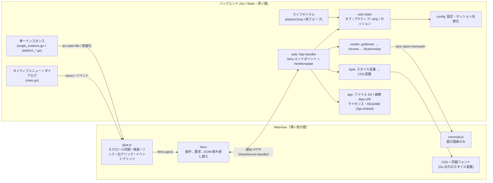
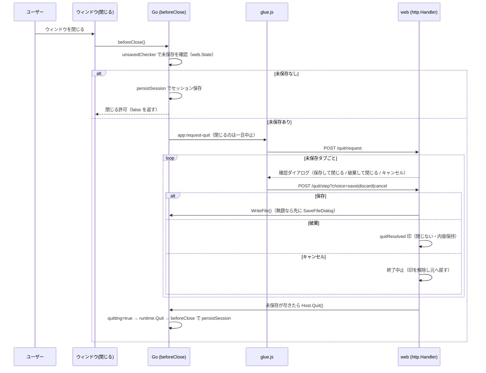
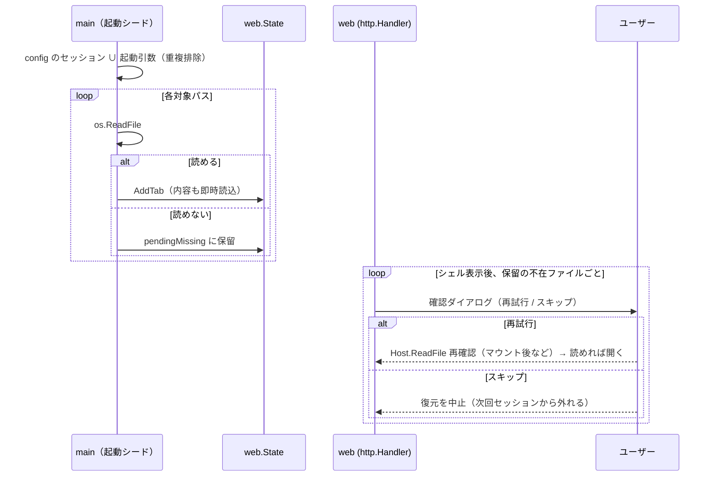

# Markmiru アーキテクチャ・画面設計

最終更新: 2026-07-23

技術スタック・要件は [`技術選定.md`](技術選定.md) を参照。本書は全体アーキテクチャと画面設計を定める。

> **実装は Go-SSR（Wails v2 ＋ Go の `html/template` ＋ htmx）**。Go を厚い層に置き、状態管理・Markdown 描画・HTML 生成・htmx エンドポイントを Go が担う。WebView 側の自作物は `glue.js` のみ（mermaid.js・htmx は既製ライブラリ）。フロントエンドのビルド工程は無い。技術選定の経緯は [`技術選定.md`](技術選定.md)／[`代替技術調査.md`](代替技術調査.md) を参照。

## 0. 確定した設計方針

| 項目 | 決定 |
|------|------|
| モード切替 | **全画面トグル**（閲覧 ⇄ 編集を丸ごと切替。閲覧重視） |
| ファイルの所在 | **複数の異なるディレクトリを横断**して読み書きする。特定フォルダ配下に限定しない |
| ファイルの開き方 | 個別に開く（ファイルダイアログ／ファイル関連付け・単一インスタンス IPC）。※ドラッグ&ドロップは未実装（対応の要否は将来検討） |
| サイドバー | **「開いている Markdown ファイルの一覧」**（フォルダツリーではない）。タブの**視認性補助**として開閉可 |
| 保存 | **手動保存（Ctrl+S）**。終了時に未保存があれば**確認ダイアログ**（保存／保存しない／キャンセル） |
| Markdown 機能 | **GFM ＋ mermaid**（標準）。数式等の拡張は段階的に追加 |
| 既定モード | 既存ファイルは**常に閲覧モード**で開く。新規作成の空ドキュメントのみ編集モード |
| セッション復元 | 起動時に前回のファイル群を**復元**（各ファイルを起動時に全件読込）。不在ファイルは**1件ずつダイアログ（再試行／スキップ）**（§5.6） |
| 外部変更監視 | **後続フェーズ**（初期リリースには含めない） |
| 生 HTML | **安全な HTML は許可**（bluemonday で危険要素のみ除去） |
| 印刷 / PDF | 印刷向け配色（紙=白・濃色文字）に変換して出力（§5.5） |
| 多重起動 | **単一インスタンス**。2 つ目の起動は既存ウィンドウへファイルを渡し前面化（§5.7） |
| 画像 | ローカルパス（相対・絶対・ルート相対）を data URI 化して表示。外部（リモート）画像は**ファイルごとに表示可否を確認**（§5.8） |
| 埋め込みドキュメント | ヘルプ→「ライセンス...」/「Markmiru について...」で同梱 `LICENSE.md` / `README.md` を**編集不可（readOnly）タブ**として表示（§5.9）。専用 About 画面は設けず README で代替 |

> **サイドバーの位置づけ**: 開いているファイルはタブと一覧の両方に現れる（ほぼ等価）。タブが増えて視認性が落ちた際に、一覧で素早く目的のファイルへ切替えるための補助 UI。異なるディレクトリの同名ファイルを区別できるよう、一覧には**親ディレクトリ等のパス情報**を併記する設計〔パス併記は**未実装**——現状はファイル名のみ表示〕。

---

## 1. 全体アーキテクチャ

Wails の構造（Go バックエンド ＋ OS 標準 WebView）に従いつつ、**Go を厚い層**に置く Go-SSR 構成。UI は Go が `html/template` で生成した HTML／HTML 断片を htmx が差し替える。

- **Go（厚い層）**: 状態管理（タブ／アクティブ／dirty／セッション／スタイル）、Markdown 描画（goldmark → chroma → bluemonday）、HTML 生成（`html/template`）、htmx エンドポイント（`http.Handler`）、任意パスのファイル I/O・ローカル画像の data URI 化、ネイティブメニュー・ネイティブダイアログ、ウィンドウ・ライフサイクル、単一インスタンス（IPC）、設定・セッションの永続化。（ファイル監視は未実装・将来課題）
- **WebView（薄い表示層）**: Go 生成 HTML の表示、htmx（操作→Go へ要求→DOM 断片差し替え）、mermaid.js（図の描画のみ）、自作 `glue.js`（編集オーバーレイのスクロール同期・ページ内検索・外部リンク横取り・メニュー/IPC イベントブリッジ・右クリックメニュー・ダイアログのフォーカス/キージャック対策）、CSS ＋ 同梱 Noto フォント。

htmx のリクエストは Wails の `AssetServer.Handler` が受け、プロセス内で Go の `http.Handler` を直接呼ぶ**疑似 HTTP**（TCP/ソケットなし）。ネイティブメニュー・IPC は Wails **イベント**（Go→JS）を glue が受け、`htmx.ajax()` で画面操作と同じエンドポイントに合流する。OS ダイアログ等の OS 連携は `web` ハンドラが Go 側で `Host` 経由で呼び、WebView から直接呼ぶ Wails **バインディング**（JS→Go）は `FocusWindow` と `Print` のみ（§1.1）。


```mermaid
flowchart LR
  subgraph Frontend["WebView（薄い表示層）"]
    HTMX["htmx<br/>操作→要求→DOM 断片差し替え"]
    Mermaid["mermaid.js<br/>図の描画のみ"]
    Glue["glue.js<br/>スクロール同期 / 検索 / リンク / 右クリック / イベントブリッジ"]
    CSS["CSS + 同梱フォント<br/>(Go 出力のスタイル変数)"]
  end
  subgraph Backend["バックエンド (Go / Wails・厚い層)"]
    Web["web: http.Handler<br/>htmx エンドポイント + html/template"]
    Render["render: goldmark → chroma → bluemonday"]
    State["web.State<br/>タブ / アクティブ / dirty / セッション"]
    Style["style: スタイル定義 → CSS 変数"]
    App["app: ファイル I/O / 画像 data URI<br/>ライセンス・README (//go:embed)"]
    SI["単一インスタンス<br/>(single_instance.go + platform_*.go)"]
    Cfg["config: 設定・セッション永続化"]
    Menu["ネイティブメニュー + ダイアログ<br/>(main.go)"]
    Life["ライフサイクル<br/>(beforeClose / 終了ループ)"]
  end

  HTMX <-->|"疑似 HTTP（AssetServer.Handler）"| Web
  Web --> Render
  Web --> State
  Web --> Style
  Web --> App
  State --> Cfg
  Style --> CSS
  Render -->|"&lt;pre class=mermaid&gt;"| Mermaid
  Menu -->|"menu:* イベント"| Glue
  SI -->|"ipc:open-file / 前面化"| Glue
  Glue -->|"htmx.ajax()"| HTMX
  Life --> State
```

### 1.1 Go 側の責務（バインドメソッドと Host インタフェース）

状態管理・描画・HTML 生成は `web` パッケージ（`web.State` ＋ `http.Handler` ＋ `html/template`）。OS 連携は `app.go` のバインドメソッド（Wails runtime を持つ）で、`web` からは `web.Host` インタフェース経由で呼ぶ（`main.go` の `webHost` アダプタが橋渡し。`web`→`main` の循環を避ける）。

`web.Host`（OS 連携の呼び出し口）: `OpenFilesDialog` / `SaveFileDialog` / `WriteFile` / `ReadFile` / `ReadmeMarkdown` / `LicenseMarkdown` / `ExportStyleDialog` / `ImportStyleDialog` / `SetEditMenuEnabled` / `SetSaveMenuEnabled` / `SetModeMenuEnabled` / `Quit` / `OpenURL` / `ClipboardText`。

WebView から直接呼ぶバインド（`window.go.main.App.*`）: `FocusWindow()`（アプリ内ダイアログ表示時のキーボードフォーカス付与。Windows 用、他 OS は no-op）と `Print()`（glue が `do-print` イベント受信時に呼ぶ印刷実行。macOS はネイティブ印刷パネル、他 OS は Wails `WindowPrint` へフォールバック。§5.5）。

| バインド/委譲メソッド | 役割 |
|----------|------|
| `OpenFiles()` | ネイティブのファイル選択（複数選択可。任意ディレクトリ）。`[]FileDoc` を返す |
| `ReadFile(path)` | 任意パスのファイル読込（`FileDoc` を返す。不在ファイルの「再試行」や IPC で使用） |
| `SaveFile(path, content)` | 任意パスへの書込（保存） |
| `SaveFileDialog(suggestedName)` | 「名前を付けて保存」先の取得 |
| `ExportStyleDialog(suggestedName)` | スタイル書き出し用の保存先取得（`*.json` フィルタ。書込は `SaveFile`） |
| `ImportStyleDialog()` | スタイル読み込み用のファイル選択（単一）。選んだファイル内容を返す |
| `ReadLicense()` / `ReadReadme()` | 同梱 `LICENSE.md` / `README.md`（`//go:embed`）の内容を返す（§5.9） |
| `LoadConfig()` | 設定の取得（`config.go`）。保存は終了時に `main` が注入したクロージャ（`persistSession`）とウィンドウ状態の `saveWindowState` が `writeConfig` 経由で行う（§7） |
| `SetEditMenuEnabled(canEdit)` / `SetSaveMenuEnabled(canSave)` / `SetModeMenuEnabled(canToggle)` | 手組み編集メニュー（Win/Linux）の編集専用項目／「保存」／「閲覧/編集切替」（全 OS）の有効・無効を切替（§9）。**サーバ主導**——`web` のミドルウェアが各 POST 後に状態から判定し、変化時だけ呼ぶ |
| `OpenExternalURL(url)` | 外部リンクを OS の既定ブラウザ／メーラで開く（§5.11） |
| `FocusWindow()` / `Quit()` | WebView にキーボードフォーカス付与 / アプリ終了。※ウィンドウの前面化は非公開の `bringToFront()`（IPC 受信時）が担当 |
| `Print()` | 印刷の実行（macOS=自前 `NSPrintOperation`、Windows/Linux=Wails `WindowPrint` へフォールバック。glue が `do-print` イベントで直接呼ぶ。§5.5） |

Go→WebView のイベント（glue が受信）: `ipc:open-file`（後発インスタンスから転送されたファイルを開く。§5.7）、`menu:<action>`（メニュー操作。例: `menu:new` `menu:open` `menu:save` `menu:saveAs` `menu:print` `menu:style-import` `menu:style-export` `menu:settings` `menu:toggleMode` `menu:toggleSidebar` `menu:license` `menu:about`。手組み編集メニュー（Win/Linux）からは `menu:undo` `menu:redo` `menu:cut` `menu:copy` `menu:paste` `menu:selectAll` `menu:find` も。§9）、`app:request-quit`（終了要求 → glue が `POST /quit/request` で終了ループ開始。§5.3）。

> 外部変更監視は**未実装**（将来課題・方式は未定。fsnotify による自動再読込は行わない。§5.4）。ディレクトリ走査やフォルダ監視も**不要**。サイドバー一覧は「開いているファイル」を `web.State` から描画するため、ファイルシステム走査を伴わない。

### 1.2 WebView 側の責務

- **htmx**: 操作（クリック等）を Go の htmx エンドポイントへ送り、返ってきた HTML 断片で該当領域（本文 `#content`／タブバー `#tabbar`／サイドバー／設定／`#dialog-host` 等）を差し替える。
- **glue.js（唯一の自作 JS）**: 編集オーバーレイのスクロール同期、**保存前の未送信編集の flush**（`menu:save`/`menu:saveAs` 受信時と Ctrl+S フォールバック時に、150ms デバウンス待ちの textarea 内容を先にサーバへ同期してから保存を叩く。§5.2）、ページ内検索（CSS Custom Highlight API・§5.12）、外部リンク横取り（§5.11）、ネイティブメニュー/IPC イベント → `htmx.ajax()` ブリッジ、ダイアログのフォーカス付与・Esc=拒否・危険側の 500ms 無効化、設定パネルの対入力（スライダー↔数値／カラー↔HEX）同期、印刷トリガ、右クリックメニュー（`contextmenu` の横取り・サーバ断片の注入・位置決め・選択とキャレットの保持・項目の実行・クローズ。§5.10）。
- **mermaid.js**: `<pre class="mermaid">` を図として描画（`securityLevel:'strict'`。テーマは本文の `data-scheme` に連動）。**図の ID は glue が自前で採番**して `mermaid.render()` を図ごとに呼ぶ（`mermaid.run()` は使わない。理由は §3 の「mermaid」）。
- **CSS ＋ 同梱フォント**: Go が出力するスタイル変数（`--md-*`）＋ ベース CSS ＋ Noto woff2（`@font-face`）。

---

## 2. データモデル（サーバ状態）

状態は Go の `web.State`（`web/state.go`）が保持する（`Tab` 構造体＋タブ集合）。フロントは状態を持たず、Go が描画した HTML を表示するだけ。

```text
Tab {
  ID                string   // 内部 ID
  FilePath          string   // 任意ディレクトリの絶対パス。"" = 無題（新規）
  FileName          string   // 表示名（例: a.md）
  Content           string   // 現在の編集内容
  SavedContent      string   // 最後に保存した内容（dirty 判定用）
  Edited            bool     // 一度でも編集されたか（元に戻しても未保存扱い）
  Mode              string   // "view" | "source"。既定は "view"
  ReadOnly          bool     // 編集不可タブ（例: ライセンス表示）。編集モード・保存を無効化
  RemoteImagePolicy string   // "" 未確認 / "allow" / "block"（外部画像。§5.8）
  quitResolved      bool     // 終了ループで「破棄」を選んだ印（非永続）
}
// dirty はフィールドではなく dirty() = Edited || Content != SavedContent で派生。

State {
  tabs / activeID           // 開いているファイル群（タブ／サイドバー一覧の共通ソース）
  styles / activeStyleID    // プリセット＋ユーザースタイル、アクティブ
  sidebarOpen / settingsOpen
  pendingMissing []string   // 起動時に開けなかったパス（再試行/スキップ。§5.6）
  pendingLinkURL string     // 外部リンク確認ダイアログの対象 URL（§5.11）
}
```

- タブとサイドバー一覧は**同じ `tabs` を参照**する（二重管理しない）。サイドバーは同名ファイル区別のためパス情報を併記する設計〔パス併記は**未実装**——現状はファイル名のみ表示。§4.1〕。
- **dirty はサーバが保持**する。編集入力（`POST /tabs/{id}/content`）の応答でタブバーを OOB 更新し、未保存マーク（•）を即時反映する。
- `ReadOnly` タブ（ライセンス等）は `FilePath=""` で開き、セッションには保存しない（§5.9）。

---

## 3. Markdown レンダリングパイプライン（閲覧モード）

描画は Go（`render` パッケージ）が一括で行う。

```text
ソース文字列
  └─ goldmark（CommonMark ＋ GFM: 表 / チェックリスト / 打消し線 / 自動リンク ＋ 脚注）
        ├─ コードフェンス ```lang    → chroma で色付け HTML（クラス方式）
        └─ コードフェンス ```mermaid → <pre class="mermaid"> プレースホルダとして出力
  └─ bluemonday でサニタイズ（許可タグ・属性のみ。script 等の危険要素を除去）
  └─ 外部リンクへ rel 付与（サニタイズ後の後処理。bluemonday の nofollow 自動付与を避けるため別ステップ）
  └─ html/template で本文断片へ埋め込み、htmx が #content へ差し替え
  └─ WebView の glue が mermaid.render() で <pre class="mermaid"> を SVG 描画
```

- **mermaid**: ` ```mermaid ` フェンスを `<pre class="mermaid">` として出力し、htmx の差し替え後に glue が描画する（`securityLevel:'strict'`）。テーマは本文ラッパの `data-scheme` に連動し、再描画する。
  - **描画は `mermaid.run()` ではなく、glue が ID を採番して `mermaid.render()` を図ごとに呼ぶ**（2026-09-03 に変更）。`run()` の ID 採番は非決定モード（既定）だと `Date.now()` を返すだけで（mermaid 11.15.0 の `InitIDGenerator`）、**同じミリ秒に描画された図どうしで ID が衝突する**。mermaid は描画中の一時要素を `"d" + ID` という id で `document.body` 直下に作り `select("#d" + ID)` で引き当てるため、衝突すると別の図の一時要素を掴み、**描画結果が別の図の枠に入る**（図が 1 つずれる／2 つの図が同じ枠に重なり、片方の枠が空になる）。`Date.now()` に連番を足せば同一ミリ秒でも一意になり、複数の描画が重なっても衝突しない。`run()` の内部処理に合わせている点は 3 つ——①`data-processed` を描画完了を待たずに付けて二重描画を防ぐ（`run()` が `await` の前に付けるのと同じ）、②第 3 引数に枠を渡して本文の CSS 下で文字幅を測らせる、③**描画は Promise チェーンで直列に行う**（`run()` が図ごとに `await` するのと同じ順序性）。③は ID が一意なら並行に投げても衝突しないが、mermaid 内部の共有状態に依存する部分で挙動が変わり得るため、上流の実行順から離れない方針を採る。
  - **検出と検証**（2026-09-03。図を 4 つ含む文書・Windows の正式ビルド）: 編集モードで末尾に文字を足して閲覧モードへ戻す操作を 6 回繰り返したところ、**修正前は 6 回とも異常**（図 2 の枠に図 3 が重なる／図 3 の枠に図 4 が重なる、の 2 通り）、**修正後は 6 回とも正常で描画結果はピクセル単位で一致**した。サーバ側の出力順は修正前から正しく（`render` パッケージの出力を確認）、原因は WebView 側のみ。
  - **macOS でも確認（2026-09-04。図を複数含む文書・正式ビルド `b112a8e` の `.app`）**: 図がそれぞれ正しい枠に正しい内容で描画され、タブ切替を繰り返しても崩れない。スタイルのライト／ダーク切替でも新しいテーマで描き直される。**印刷（Cmd+P）はネイティブ印刷パネルのプレビューに図が描画済みで載る**ことを確認（macOS は `window.print()` ではなく Go 側のネイティブ印刷を通る唯一の OS のため個別に確認した）。
  - **Linux でも確認（2026-09-09。図を 4 つ含む文書・正式ビルド `e2a1b00` のバイナリ。Ubuntu 24.04・WebKitGTK 4.1〔X11／GNOME Shell〕）**: 初期表示で 4 図がそれぞれ正しい枠に正しい内容で描画され、Windows と同じ手順（編集モードで末尾に 1 文字足して閲覧モードへ戻す）を 6 回繰り返しても、タブ切替を 3 往復しても**入れ替わりは 0 件**。図 1〜3 は基準画像と**ピクセル単位で一致**し、クラス図（図 4）だけは枠線のアンチエイリアスが再描画ごとに ±1 程度ゆらぐ（最大チャネル差 9・全画素の 0.15% 程度）が、**再描画どうしを比べても同じ差が出る**ため描画位置のずれではない——Windows の「ピクセル単位で一致」との違いは WebKitGTK の描画側の性質。**印刷（Ctrl+P → Wails `WindowPrint` → GTK 印刷ダイアログ）は「ファイルに出力する」で PDF 化して確認**し、4 図すべてが描画済みで正しい枠に、印刷向けの配色で出力された。
- **サニタイズ**: goldmark 出力を bluemonday の許可リストで無害化（chroma のコードは許可クラスを通す）。mermaid の SVG はサニタイズ対象外（WebView 側で描画）。
- **再描画**: 編集入力はデバウンスして `POST /tabs/{id}/content`（ハイライト層のみ再描画）。閲覧モードへ切替時は最新内容で本文を描画。
- **画像**: ローカル画像は Go（`render`）が data URI 化、外部（リモート）画像はファイルごとに表示確認、文書と別ホストを指す UNC 画像は確認を出さず常に遮断（§5.8）。
- **外部リンク**: クリック時に glue が横取りして確認ダイアログ（§5.11）を挟み、許可されたら `OpenExternalURL`（`BrowserOpenURL`）で OS ブラウザへ委譲。全レスポンスに CSP（`script-src 'self' 'unsafe-eval'` 等。`unsafe-eval` は mermaid / htmx の Function コンストラクタに必要）をミドルウェアで注入。

---

## 4. 画面設計

### 4.1 ウィンドウ全体（閲覧モード・サイドバー開）

サイドバーは「開いているファイル一覧」。各項目に**ファイル名＋パス情報**と未保存マーク（`*`）を表示し、クリックで該当タブへ切替える設計〔パス併記・未保存マークは**未実装**——現状はファイル名のみ表示。未保存表示はタブバーの「•」のみ〕。

```text
┌─────────────────────────────────────────────┐
│ ネイティブメニュー（ファイル / 編集 / 表示 / ヘルプ）      │
├──────────────┬──────────────────────────────┤
│ 開いているﾌｧｲﾙ │ [☰] [a.md] [b.md*] [c.md] … [+] │ ← タブバー
│ ──────────── ├──────────────────────────────┤
│▶ a.md         │                              │
│   ~/proj      │                              │
│  b.md  *      │                              │
│   ~/docs      │      レンダリング表示          │
│  c.md         │      （閲覧モード）            │
│   ~/notes     │                              │
│              ├──────────────────────────────┤
│              │ 文字数:1234   UTF-8   ● 保存済  │ ← ステータスバー
└──────────────┴──────────────────────────────┘
```

- `▶` は選択中（アクティブ）のファイル。`*` は未保存。
- 同名ファイルでも `~/proj` `~/docs` 等のパス併記で区別できる〔図は設計案。パス併記は**未実装**——現状はファイル名のみ〕。
- サイドバーは開閉可（`Ctrl+B`、タブバー左端の `☰`）。閉じるとコンテンツが全幅になる。タブが少なければ閉じたままでも支障ない。
- タブバーに機能ボタン（開く/モード切替/保存/設定/About/ライセンス）は置かない。すべて**ネイティブメニュー**から呼び出す（§9）。

### 4.2 編集モード（サイドバー閉）

```text
┌─────────────────────────────────────────────┐
│ ネイティブメニュー                              │
├─────────────────────────────────────────────┤
│ [☰] [a.md] [b.md*]                        [+] │
├─────────────────────────────────────────────┤
│ # 見出し                                      │
│                                              │ ← 透明 textarea ＋
│ ```mermaid                                   │   chroma ハイライト層の
│ graph TD; A-->B;                             │   オーバーレイ（§6・下記）
│ ```                                          │
├─────────────────────────────────────────────┤
│ 行:3 列:5   文字数:1234   UTF-8   ● 未保存      │
└─────────────────────────────────────────────┘
```

### 4.3 画面の構成（Go-SSR シェルとテンプレート）

UI は Go の HTML テンプレート（`web/templates/`）で生成し、htmx が領域ごとに差し替える。シェル（`shell.html`）の主なリージョンと、差し替え対象の断片（`fragments.html`）は次のとおり。

```text
#app[data-scheme]
├─ #tabbar        … タブバー（tabbar-inner: サイドバートグル/タブ一覧/新規。機能ボタンは置かずメニューから呼び出す）
├─ .body-row
│  ├─ #sidebar    … 開いているファイル一覧（sidebar-inner。tabs から描画・開閉）
│  └─ #content    … 本文（content: 閲覧=preview / 編集=textarea オーバーレイ）
├─ #settings      … スタイル設定モーダル（settings-modal。常時レンダリング＋[hidden] で表示制御）
├─ #dialog-host   … 確認ダイアログの差し込み先（remote / close-unsaved〔終了確認は Quit フラグで兼用〕/ link / missing-file）
├─ #ctxmenu-host  … 右クリックメニューの差し込み先（§5.10）
└─ #find-host     … ページ内検索バーの差し込み先（§5.12）
```

- **本文（content）**: 閲覧は `.preview-scroll > .markdown-body`（Go 生成の安全な HTML）、編集は透明 `<textarea>` ＋ chroma ハイライト層のオーバーレイ（§6）。
- **ダイアログ**: いずれもサーバが `html/template` で描画して `#dialog-host`（または `#settings`）へ htmx で差し込む。共通の見た目（`.mm-backdrop` / `.mm-dialog`）と、glue の共通制御（フォーカス付与・Esc=拒否・Enter=既定ボタン・危険側の 500ms 無効化）を再利用する。
- 唯一の自作 JS は `web/assets/glue.js`。テンプレートは `shell.html`（シェル）と `fragments.html`（断片）。

> 専用の `StatusBar`（§4.1 / §4.2 のステータスバー）は未実装（将来案）。

### 4.4 htmx エンドポイント一覧（実装）

`web.NewHandler`（`http.Handler`）が返す htmx エンドポイント。すべて Wails の `AssetServer.Handler` 経由の疑似 HTTP（§1）で、全レスポンスに CSP ヘッダを付与する（`withCSP` ミドルウェア）。ネイティブメニュー／IPC は Wails イベント → glue が下表の同じエンドポイントを叩いて合流する。応答の多くは `nav`（本文＋タブバー/サイドバー/`#dialog-host` を OOB 更新）。

| メソッド / パス | 役割 | 返す / 差し替え先 |
|---|---|---|
| `GET /` | アプリシェル（状態から描画） | 全体 HTML |
| `GET /assets/…` | 同梱静的アセット（htmx / mermaid / glue.js / CSS / フォント woff2） | 静的ファイル |
| `GET /tabs/{id}/view` | 指定タブの閲覧断片 | 本文＋`#dialog-host` OOB |
| `POST /tabs/new` | 新規タブ（無題・編集モード） | nav |
| `POST /tabs/open` | OS ダイアログでファイルを開く | nav |
| `POST /tabs/open-path` | パス指定で開く（IPC／ファイル関連付け。既存は再アクティブ化） | nav |
| `POST /tabs/{id}/activate` | タブ切替 | nav |
| `POST /tabs/{id}/close` | タブを閉じる（未保存は3択。`?choice=save\|discard\|cancel`） | nav or ダイアログ（`HX-Retarget: #dialog-host`）。cancel・保存先選択キャンセル時＝navkeep |
| `POST /tabs/{id}/mode` ／ `POST /active/mode` | 閲覧/編集 切替（指定／アクティブ） | nav |
| `POST /tabs/{id}/content` | 編集中の本文更新＋再ハイライト | ハイライト層の**中身のみ**（`#hl-{id}` へ innerHTML。`<pre>` 要素は差し替えず、スクロール位置は原則ブラウザが保持。行数が増える編集で同期がクランプされた場合のみ glue が afterSwap で再同期）＋タブバー OOB（未保存マーク） |
| `POST /tabs/{id}/save`・`/save-as` ／ `POST /active/save`・`/save-as` | 保存（無題は OS 保存ダイアログ。**未変更タブへの「保存」は書き込まない**＝§5.2） | 原則 navkeep（`HX-Reswap: none`。本文は差し替えずタブバー/サイドバー/ダイアログ host のみ OOB＝スクロール位置・キャレット保持、ダイアログは閉じる）。保存先が決まった/変わり、かつ閲覧モードで表示中のアクティブタブのとき＝nav（BaseDir が変わるため本文再描画） |
| `POST /active/print` | 印刷（アクティブを閲覧に強制） | nav（`HX-Trigger-After-Settle: do-print`） |
| `POST /tabs/{id}/remote-images?choice=allow\|block` | 外部画像の表示可否（§5.8） | 本文＋`#dialog-host` OOB |
| `POST /sidebar/toggle` | サイドバー開閉 | `#sidebar` |
| `POST /settings/toggle` | 設定モーダル開閉 | `#settings` |
| `POST /settings/style`（`value`=スタイルID） ／ `/duplicate` ／ `/delete` | スタイル選択（プルダウン）／複製／削除（パネル最下部の危険ボタン） | restyle（本文＋OOB） |
| `POST /settings/field/{key}` ／ `/heading/{n}/{key}` | スタイル1フィールド編集（ライブプレビュー） | `#styleblock`（色スキーム等は restyle、customCSS は `#customcss`） |
| `POST /settings/rename` ／ `/export` ／ `/import` | 改名／エクスポート／インポート | `#settings` or 本文 |
| `POST /find/open` | ページ内検索バーを開く（走査・ハイライトは glue。§5.12） | `#find-host` |
| `POST /ctxmenu/open` | 右クリックメニュー断片（項目は常に同一・活性のみ状況連動。`sel`=選択有無・`undo`/`redo`=取り消し履歴の残量・`link`=リンク URL。§5.10） | `#ctxmenu-host` |
| `POST /clipboard/read` | OS クリップボードのテキスト（貼り付け用。`text/plain`。DOM は差し替えず glue が挿入。§5.10） | ―（htmx 非経由） |
| `POST /link/confirm` ／ `/open` ／ `/dismiss` | 外部リンク確認 →`Host.OpenURL`（§5.11） | `#dialog-host`（OOB クリア） |
| `POST /missing/retry` ／ `/skip` | 不在ファイルの再試行／スキップ（§5.6） | nav（＋次の確認） |
| `POST /quit/request` ／ `/quit/step` | 終了ループ（未保存を順に確認 →`Host.Quit`。§5.3） | ダイアログ or nav。cancel・保存先選択キャンセル時＝navkeep |
| `POST /doc/about` ／ `/doc/license` | 同梱 README／LICENSE を読み取り専用タブで開く（§5.9） | nav |

---

## 5. 主要フロー

### 5.1 ファイルを開く（複数ディレクトリ横断）

1. メニュー「開く」（複数選択可・`POST /tabs/open`）／OS のファイル関連付け・単一インスタンス IPC（`POST /tabs/open-path`）。（ドラッグ&ドロップは未実装）
2. 内容取得: 「開く」は `OpenFilesDialog` が選択ファイルを読み込んで返す。関連付け／IPC は `Host.ReadFile(path)` で読む（パスは任意ディレクトリ）。
3. 新規タブを追加（**既定 `mode='view'`**、`savedContent=content`）。関連付け／IPC 経由（`open-path`）は**既に同じ `FilePath` のタブがあれば再アクティブ化**する。一方メニュー「開く」は毎回新規タブを追加する（同一ファイルの重複は排除しない）。画像解決の基点ディレクトリは `FilePath` から派生（`dir()`）。
4. タブとサイドバー一覧の双方に反映（同一 `tabs` を参照）。

> **既定モード**: 既存ファイルは**常に閲覧モード**で開く。**新規作成の空ドキュメントのみ**、編集が目的のため**編集モード**で開く。
> **外部変更監視**は未実装（将来課題・方式は未定。§5.4）。

### 5.2 保存（Ctrl+S）

0. **保存前の flush（クライアント）**: `menu:save` / `menu:saveAs` / Ctrl+S フォールバックを受けた glue は、編集中 textarea の**未送信内容（150ms デバウンス待ち）を先に `POST /tabs/{id}/content` で同期してから**保存エンドポイントを叩く。これにより「入力直後の Ctrl+S」が古い内容の保存や no-op 空振りにならない。なお「保存」メニューが無効（サーバがクリーン認識）の間はネイティブアクセラレータが発火せずキーが WebView に届くため、glue の keydown が Ctrl+S を拾って同じフローへ流す（有効時はネイティブ側が先に消費）。
1. **未変更（dirty でない）タブへの「保存」はファイルへ書き込まない**（完全 no-op）。外部変更監視が無いため、他エディタでの編集を開いた時点の古い内容で上書きする事故を防ぐ（VS Code / Emacs と同方式）。「名前を付けて保存」と無題の初回保存は対象外（常に書き込む）。**閉じる/終了ダイアログの「保存して閉じる」経路（`saveTabForClose`）も同じ規律**（clean なら書き込まずに閉じる）。
2. `FilePath` が空（`""`＝無題）なら Go `SaveFileDialog` で保存先取得（任意ディレクトリ）。
3. Go `SaveFile(path, content)`（`FileDoc` を返す）。書き込みは共通コア `writeTab` 経由。
4. `savedContent` は**実際に書き込んだスナップショット**とし、タブ／一覧の `*`（未保存マーク）を消す。**書き込み I/O 中にさらに編集が届いた場合は dirty のまま残す**（現在値を保存済み扱いにすると、未書き込みの編集が clean 誤認され再保存も終了確認もされずに消えるため）。
5. `readOnly` タブ（ライセンス等）では保存系の操作は無効。
6. **表示位置の保持**: 上書き保存（保存先が変わらない保存・未変更 no-op・キャンセル含む）は本文（`#content`）を差し替えず（`HX-Reswap: none` の navkeep 応答）、閲覧のスクロール位置・編集キャレットをそのまま保つ。保存先が決まった/変わったとき（無題の初回保存・名前を付けて保存）も、再描画するのは**閲覧モードで表示中のアクティブタブのみ**（画像解決の基点 BaseDir が変わるため）。編集モードは BaseDir と無関係なので再描画せずキャレットを保つ。
7. **ダイアログとの整合**: navkeep 応答はダイアログ host も OOB で更新する（Dialog=nil＝閉じる）ため、確認ダイアログ表示中に Ctrl+S で保存した場合も、前提が消えた「未保存の変更があります」ダイアログが残らない。

### 5.3 終了時の未保存確認

ウィンドウの閉じる操作は Go の `beforeClose` が捕捉する。未保存の有無は**サーバ状態**（`web.State.HasUnsaved`、`main` が `unsavedChecker` として注入）で判定する。未保存があれば一旦閉じるのを止め、`app:request-quit` を発火。glue が `POST /quit/request` を叩き、**サーバが終了ループを主導**する——未保存タブを1つずつ確認ダイアログ（保存して閉じる／破棄して閉じる／キャンセル）で処理し、`POST /quit/step` で次へ進む。未保存が尽きたら `Host.Quit()`。終了ループでは対象タブを閉じずに解決する（保存＝clean 化、破棄＝`quitResolved` 印）ため、途中でキャンセルすれば全タブが元の未保存状態に戻る。セッション（開いていたファイル・スタイル・サイドバー）は `beforeClose` の閉じる許可経路で `persistSession` が config に保存する。


```mermaid
sequenceDiagram
  participant U as ユーザー
  participant W as ウィンドウ(閉じる)
  participant Go as Go (beforeClose)
  participant Glue as glue.js
  participant Web as web (http.Handler)

  U->>W: ウィンドウを閉じる
  W->>Go: beforeClose()
  Go->>Go: unsavedChecker で未保存を確認（web.State）
  alt 未保存なし
    Go->>Go: persistSession でセッション保存
    Go-->>W: 閉じる許可（false を返す）
  else 未保存あり
    Go->>Glue: app:request-quit（閉じるのは一旦中止）
    Glue->>Web: POST /quit/request
    loop 未保存タブごと
      Web-->>Glue: 確認ダイアログ（保存して閉じる / 破棄して閉じる / キャンセル）
      Glue->>Web: POST /quit/step?choice=save|discard|cancel
      alt 保存
        Web->>Go: WriteFile()（無題なら先に SaveFileDialog）
      else 破棄
        Web->>Web: quitResolved 印（閉じない・内容保持）
      else キャンセル
        Web->>Web: 終了中止（印を解除し元へ戻す）
      end
    end
    Web->>Go: 未保存が尽きたら Host.Quit()
    Go->>Go: quitting=true → runtime.Quit → beforeClose で persistSession
  end
```

### 5.4 外部変更の検知（将来課題・方式は未定）

> **未実装。** 対応する場合も、**fsnotify による自動再読込・競合確認は行わない**（2026-07-23 決定）。どのように対応するか（通知のみ・手動再読込の提供等）の検討から着手する。

### 5.5 PDF 出力 / 印刷

OS / WebView の印刷機能＋**印刷用 CSS（`@media print`）** を用い、OS の「PDF として保存」で出力する（外部依存なし・クロスプラットフォーム）。印刷の起動は Go バインドの `Print` に委譲する: macOS は自前の `NSPrintOperation`（`platform_darwin.go` の cgo）でネイティブ印刷パネルを開き（WKWebView は `window.print()` を無視し、Wails `WindowPrint` は横向き固定でパネルに向きの選択肢が出ないため）、縦向きをデフォルトに向き・用紙サイズ・拡大縮小をパネルで変更可能にし、用紙余白を Windows/Linux の既定と同等（約 1cm）にする（WKWebView を特定できない場合のみ Wails `WindowPrint` へフォールバック）。Windows/Linux は Wails `WindowPrint` 経由で WebView 内の `window.print()` を実行する（従来から縦デフォルト・向き変更可）。

- **配色は印刷向けに変換**（紙=白背景・濃色文字）。組版（フォント/サイズ/余白）はアクティブなスタイルを継承する。
- **mermaid の描画完了を待ってから印刷する**（2026-09-03）。`/active/print` の応答が `HX-Trigger-After-Settle: do-print` を返し、htmx は settle 後に `htmx:afterSettle` を発火してから後設定トリガを流すため（`afterSettleCallback`）、glue が `do-print` を受けた時点で図の描画は既にキューに積まれている。そのキュー（§3 の直列チェーン）の完了を待ち、レイアウト反映のため 1 フレーム置いてから `Print()` を呼ぶ。**以前は 250ms の固定待ち**で、図が多い文書や遅い環境では図が未描画のまま印刷され得た。描画が返らない場合に印刷できなくならないよう、待ちには上限（5 秒）を設けている。
- **Linux の PDF 出力で末尾に空白ページが 1 枚出ることがある（2026-09-09 に観測・原因未調査）**: 図を 4 つ含む検証文書を GTK 印刷ダイアログの「ファイルに出力する」で PDF 化したところ、本文は 2 ページに収まっているのに**3 ページ目が空白で出力**された。図の描画自体は正常（上記の Linux 検証）。他の文書や他 OS でも同じかは未確認で、原因（印刷用 CSS の余白か WebKit の分ページか）も未調査。
- 詳細は [`スタイル設定設計.md`](スタイル設定設計.md) §5.2 を参照。

※ ワンアクションの無確認 PDF エクスポート（WebView2 `PrintToPdf` 等）は**対応不要と決定**（2026-07-23。印刷機能経由の PDF 出力で足りる）。

### 5.6 起動時のセッション復元

前回開いていた**ファイル群（パス一覧）を起動時に再オープン**する。終了時の未保存確認（§5.3）により、復元対象は**保存済みでパスを持つファイル**のみ（未保存バッファの保持は不要）。実装は `main` の起動シード（config → `web.State`）。

- **開く対象**: 前回セッション ∪ 起動引数（重複排除）。起動引数（ファイル関連付け等）で指定したファイルは前回セッションと**マージ**され、最後がアクティブになる。各ファイルは起動時に**全件、内容まで読み込んで**タブを開く。
- **不在ファイルの扱い**: パスが存在しない場合、`web.State` に保留（`pendingMissing`）し、シェル表示時に**1件ごとの確認ダイアログ**（`POST /missing/retry` / `/missing/skip`）を表示する。
  - **再試行**: `Host.ReadFile` で存在を再確認（ファイルサーバーのマウント忘れ等を想定）。読めれば開き、まだ無ければ再度ダイアログ。
  - **スキップ**: そのファイルの復元を諦める（次回保存されるセッションからは外れる）。
- **クラッシュ（異常終了）時**の未保存内容は失われる（自動保存はしない方針のため）。設定・セッションの保存は**終了時**（`beforeClose`）に行うため、強制終了時はその回の変更が保存されない。クラッシュ復旧は**対応しない**（2026-07-23 決定）。


```mermaid
sequenceDiagram
  participant Main as main（起動シード）
  participant St as web.State
  participant Web as web (http.Handler)
  participant U as ユーザー

  Main->>Main: config のセッション ∪ 起動引数（重複排除）
  loop 各対象パス
    Main->>Main: os.ReadFile
    alt 読める
      Main->>St: AddTab（内容も即時読込）
    else 読めない
      Main->>St: pendingMissing に保留
    end
  end
  loop シェル表示後、保留の不在ファイルごと
    Web->>U: 確認ダイアログ（再試行 / スキップ）
    alt 再試行
      U-->>Web: Host.ReadFile 再確認（マウント後など）→ 読めれば開く
    else スキップ
      U-->>Web: 復元を中止（次回セッションから外れる）
    end
  end
```

### 5.7 単一インスタンス（多重起動防止）

2 重起動を防ぎ、2 つ目以降の起動は**既存ウィンドウへファイルを渡して前面化**する（実装: `single_instance.go`（共通）＋`platform_*.go`（OS 固有）、起動引数の受け渡しは `app.go`）。

- **ロック兼 IPC チャネル**: ユーザー固有ディレクトリ（`os.UserCacheDir`）内のソケットで `ensureSingleInstance()` を行う。リスナーを起動できれば先発、既存があれば後発と判定。
- **後発インスタンス**: 開こうとしたファイルパスを**送信前に絶対化**して IPC で先発へ送信し（先発はカレントディレクトリが異なる〔ドック起動なら `$HOME` 等〕ため、相対パスのままでは解決できない）、**先発が接続を閉じる（＝処理完了）のを待ってから**終了（`os.Exit`）する（上限 2 秒）。即時 exit すると Linux のピア検証（`/proc/<pid>/exe` 照合）の時点で自プロセスが消えており受け渡しが破棄されるため。ペイロードはパス数・長さに上限を設けて検証する。なお Linux のピア検証は、実行中のバイナリ置換（再ビルド等）で `/proc/<pid>/exe` に付く「` (deleted)`」接尾辞を除いて比較する（同一パスの新旧バイナリ間の受け渡しを許容）。
- **先発インスタンス**: 受信パスを `ipc:open-file` イベントで WebView へ渡し（glue が `POST /tabs/open-path`。既に開いていれば再アクティブ化）、ウィンドウを前面化（`platformRaiseWindow`。OS 依存: Windows=`SetForegroundWindow`、Linux=`gtk_window_present`〔Wails の `WindowShow` は Linux では `gtk_widget_show` のため既表示ウィンドウを前面化できない。Wayland ではコンポジタのフォーカス奪取防止により、前面化の代わりにドックの注目表示となる場合がある〕、macOS=`WindowShow` が前面化まで実施のため no-op）。
- **起動時の引数**: 起動引数は `main` の起動シードで前回セッションとマージして開く（§5.6）。以後の IPC はイベントで即時配信する。
- プラットフォーム別の OS 固有ネイティブ補助（IPC ピア検証・ウィンドウ前面化・WebView フォーカス）: `platform_{windows,darwin,linux,other}.go`。

### 5.8 画像の表示（ローカル / 外部）

信頼できない Markdown を安全に扱うため、画像はソース種別で扱いを分ける（実装: `render` パッケージ）。

- **ローカル画像**（相対・絶対・ルート相対パス）: Go（`render`）が読み込んで **data URI 化**して埋め込む。基点は当該ファイルのディレクトリ。読み取り自体はログオンユーザー権限の範囲であり許容（内容は data URI としてインライン化されるだけで外部送出は伴わない）。
- **外部（リモート）画像**（`http`/`https`/プロトコル相対 `//`）: 既定では**遮断**してレンダリングし、**ファイルごとに表示可否を確認**する。確認ダイアログはサーバが `#dialog-host` へ描画し、危険側「表示する」は glue が 500ms 無効化＋Enter 無効（§5.11）、安全側「表示しない」は Esc 対応。結果は `Tab.RemoteImagePolicy`（`allow` / `block`）として保持するが、**セッションには永続化しない**（次回起動時に再確認）。判定は `src` に加え **`srcset` の全候補**を走査し（先頭候補だけを見る回避を防ぐ）、先頭空白による判定回避も正規化して防ぐ。
- **クロスホスト UNC 画像**（`\\別ホスト\…`。文書の置かれたサーバとは**異なるホスト**を指す UNC）: **表示確認を出さず常に遮断**し、読み込まない。Windows では別サーバへの SMB 接続が自動 NTLM 認証を伴い**認証情報（NetNTLMv2 ハッシュ）が外部へ漏洩する**ため、「表示しますか？」で選ばせてよい種類の操作ではない、という判断。**同一ホスト UNC**（文書と同じサーバ上の画像。ファイルサーバー上に置いた文書＋相対画像の正規シナリオ）はローカル同様に読み込む。判定は decode 後に行い、percent-encode 版 UNC（`%5C%5C…`）も遮断する。実装は `render.isCrossHostUNC` で、読み取りの実体 `imageToDataURI` でも多層防御として同じ判定を行う。
  - 正規の利用で「ローカル文書から別サーバの画像を UNC 直書きで参照」したい稀なケースは、**相対パス化**・**ドライブレター付き絶対パス化**（`Z:\…` のようにネットワークドライブ割り当ては UNC 文字列ではないため対象外）で対応できる。

### 5.9 埋め込みドキュメント表示（ライセンス / About）

ヘルプメニューから、実行バイナリに埋め込んだドキュメントを**編集不可タブ**として表示する。専用の About 画面は設けず、README をその代替とする。

- **ライセンス**: 「ライセンス...」（`menu:license` → glue → `POST /doc/license`）→ `LICENSE.md`（Markmiru 本体＋サードパーティを統合）を `//go:embed` で埋め込み、`Host.LicenseMarkdown()` で取得。
- **About（README）**: 「Markmiru について...」（`menu:about` → `POST /doc/about`）→ `README.md` を `//go:embed` で埋め込み、`Host.ReadmeMarkdown()` で取得。先頭に**バージョン（git ショート SHA）**を表示する（ldflags `-X main.version` で埋め込み。素のビルドでは `dev`）。OS のプロパティにも同じ版を埋め込む（AGENTS.md「バージョン番号」参照）。
- いずれも別ファイルの配置は不要。`web.State.OpenDoc()` が `ReadOnly=true` のタブで開く（`FilePath=""`。一覧にパスは出ず、セッションにも保存されない）。既に開いていればそのタブをアクティブ化する。
- `readOnly` タブは編集モードへ切替えられず、保存系の操作も無効（§2、§5.2）。

### 5.10 コピー／貼り付け・全選択（メニューとキーボード）

編集操作はネイティブメニュー（§9）とキーボード、glue、および**自前の右クリックコンテキストメニュー**で提供する。

- **右クリックメニュー**: 本文（`#content`）内の `contextmenu` を glue が横取りし、サーバ断片（`POST /ctxmenu/open`）を `#ctxmenu-host` へ注入して表示する。**項目の並びは全ての場合で同一**（元に戻す／やり直し／切り取り／コピー／貼り付け／すべて選択／リンクを開く...／リンクの URL をコピー）とし、**状況によって使えないものは非活性（グレーアウト）にする**——閲覧モードでは取り消し／やり直し／切り取り／貼り付けが、取り消し履歴を使い切っていれば取り消し／やり直しが（全て元に戻した後の「元に戻す」、全てやり直した後の「やり直し」）、選択が無ければ切り取り／コピーが、リンク上でなければリンク 2 項目が非活性。活性判定はサーバが行い（モードはサーバ状態、選択の有無・取り消し履歴の残量・リンク URL は glue が収集して渡す。履歴の残量はネイティブの取り消し履歴にしか無いため `document.queryCommandEnabled('undo'|'redo')` で問い合わせる。非推奨 API のため未対応環境では活性のままにフォールバックする。同 API はフレーム単位の取り消しスタックを見るため、タブ切替直後は前タブの履歴で活性に見え得る＝§10 の将来課題）、リンク URL は glue が `externalHref`（§5.11 のクリック経路と共有する外部リンク判定）で選び、**サーバも同じ判定——外部スキーム（http/https/mailto）のみ許可し、アプリ自身のオリジンは除外——で再検証**する（開く操作自体も §5.11 の `/link/confirm` → `/link/open` で検証される多層防御）。編集操作はネイティブメニューと同じ glue の実装（`editExec`）に、「リンクを開く...」は §5.11 の確認フローに合流する。位置決め（クリック座標・画面内クランプ。設定までは CSS で非表示）とクローズ（Esc／外側クリック／スクロール／リサイズ／フォーカス喪失）は glue が担う。本文の外（タブバー・設定パネル等）では表示しない。
- **右クリックは選択もキャレットも変えない**: glue は**本文内のコンテキストクリックでは選択の有無にかかわらず `mousedown` の既定動作を抑止**する（3 OS 共通）。理由は 2 つある。(a) 既定では選択範囲の**外**を右クリックすると選択が解除され、「コピー」等が非活性に戻って実質使えない。(b) **macOS の WebKit はコンテキストクリックでポインタ下の単語を自動選択する**ため（`EditingBehavior::shouldSelectOnContextualMenuClick()` が `EditingBehaviorType::Mac` でのみ true。Windows の Blink は Mac/ChromeOS のみ、Linux の WebKitGTK は Unix behavior のため該当しない）、抑止しないと**何も選択していないのに切り取り／コピーが活性化し、実行できてしまう**（2026-08-16 の macOS 実機検証で発見）。抑止の結果、右クリックはキャレットを動かさないため、**「貼り付け」は直前のキャレット位置に入る**（クリック位置ではない）。加えて保険として、glue は `mousedown` 時点の選択を記録し、`contextmenu` の時点で変化していれば元へ戻したうえでメニューの活性判定（`sel`）に**記録した方の値**を使う（抑止で自動選択が止まらない WebView でも仕様どおりになる）。キーボードからのメニュー起動（Windows / Linux の Menu キー・Shift+F10）は `mousedown` を伴わないため、記録が無ければ従来どおり `contextmenu` 時点の実測にフォールバックする。メニュー自体の上での `mousedown` も同様に抑止し、本文の選択を保ったまま項目を実行する。

- **編集操作の実行**: ネイティブ編集メニュー（Win/Linux は手組み・§9）の `menu:undo|redo|cut|copy|paste|selectAll` を glue が受け、`document.execCommand`（取り消し・切り取り等）または textarea 操作で実行する。クリップボードは WebView 標準（Ctrl+C/V/X）と共有。**取り消し／やり直しのキー操作（Ctrl+Z / Ctrl+Shift+Z。macOS は Cmd+Z / Cmd+Shift+Z）は glue の keydown が拾って同じ経路へ流す**——Linux の WebKitGTK は GTK3 由来のキーバインドに取り消し／やり直しを持たず、キーだけでは何も起きないため（2026-08-21 の Linux 検証で判明）。**OS 分岐は持たず 3 OS 共通で拾う**: Windows はネイティブでも動くがメニューと同じ `execCommand` に合流するだけで結果は変わらず、macOS は **Cmd+Z / Cmd+Shift+Z** がネイティブ編集メニューのキー等価として登録されているため（Wails の `WailsMenu.m` が `undo:` / `redo:` に Cmd+Z / Cmd+Shift+Z を割り当てる）、WebView へ届く前に消費されて glue は通らない。一方 **Ctrl+Z / Ctrl+Shift+Z は Cmd 側と違って消費されないため glue が拾い**、同じ取り消し／やり直しとして動く（macOS の標準キーバインドで Ctrl+Z は未割り当てのため既定動作を奪わない。`Ctrl+Y`＝yank や `Ctrl+A`＝行頭移動のような割り当て済みのキーとは異なる。2026-08-29 の macOS 実機確認）。IME 変換中（`isComposing`）と、本文以外の入力欄（検索バー・設定パネル）では横取りせずその欄の既定動作に任せる（Windows の実機では、変換中の 1 回目の Ctrl+Z を IME が変換の確定に使い、2 回目で入力の取り消しになる＝IME 側の挙動。2026-08-30 確認）。
- **「貼り付け」だけは Go 経由**: Chromium 系 WebView は script からのクリップボード**読み取り**を禁止しており（`execCommand('paste')` は無効、`navigator.clipboard.readText()` は権限要求）、WebView 側だけでは実装できない。そこで glue が `POST /clipboard/read` を叩き、サーバが `Host.ClipboardText`（Wails `runtime.ClipboardGetText`）で読んだテキストを `text/plain` で返し、glue が `document.execCommand('insertText')` で挿入する——この経路ならネイティブの取り消し履歴に載り、htmx が待つ `input` イベントも発火する（＝編集がサーバへ送られ dirty になる）。Ctrl+V は WebView が自前で処理するためこの経路を通らない。右クリックメニューとネイティブ編集メニューの双方がこの実装を共有する。
- **全選択（Ctrl+A / メニュー「すべて選択」）**: glue が入力欄の外でも本文に限定して全選択する——閲覧は本文（`.markdown-body`）、編集は textarea——ことでウィンドウ全体の選択を防ぐ。閲覧モードの「コピー」は現在の選択をコピーする。
- **検索（Ctrl+F / メニュー「検索...」）**: 両モードとも glue のページ内検索（§5.12）を開く。
- 編集専用項目（取り消し/やり直し/切り取り/貼り付け）は閲覧モードで非活性（サーバ主導。§9）。

### 5.11 危険な選択を伴う確認ダイアログ（共通）

外部アプリ起動・外部通信など**ユーザーにリスクのある選択**を伴う確認は、サーバが `#dialog-host` へ描画する確認ダイアログ（`.mm-dialog`）で行い、防御は glue の共通制御で担う。**Chromium のガイドライン**（Security Considerations for Browser UI）に倣う。

- **危険側ボタンは `data-dialog-accept`**: サーバ HTML で `disabled` 済み。glue が**表示から約 500ms 後に有効化**する（**clickjacking 対策**＝起動遅延）。既定ボタン（Enter）にはしないため、Enter では発動しない（**keyjacking 対策**）。
- **安全側ボタンは `data-dialog-reject`**（Esc で実行）。安全な既定動作は `data-dialog-default`（Enter で実行）。初期フォーカスはダイアログ枠に置く。
- Windows では表示時に `FocusWindow()` で WebView にキーボードフォーカスを与える。

利用箇所（サーバ描画ダイアログ＋対応エンドポイント）:

- **外部リンクを開く**（閲覧モード）: glue が `http(s)` / `mailto` のクリックを capture フェーズで横取りし、`POST /link/confirm` で確認ダイアログを出す。「はい」（危険側・500ms 遅延）→ `POST /link/open` → `Host.OpenURL`（`BrowserOpenURL`）で OS の既定アプリへ。スキームはサーバでも再検証する。ページ内アンカー（`#...`）は glue が見出しへスクロール、未知スキーム・相対はブロック（`links` 相当を glue で再現）。
  - **外部かどうかの判定は glue の `externalHref` に一本化**し、クリック経路と右クリックメニュー（§5.10）が共有する。`a.href` は**解決済みの絶対 URL**なのでスキームだけでは判定できない——**Wails の配信元は Windows だけ `http://wails.localhost/`**（macOS/Linux は `wails://wails/`）で、文書内アンカーも相対リンクも `http://` に化けるため、raw href の `#` 判定と**自オリジンの除外**を併せて行う。サーバの `isExternalURL` も同じくホスト `wails.localhost` を外部とみなさない。
  - 2026-08-17 の Windows 実機検証で、この OS 差により**文書内アンカーの上で右クリックするとリンク 2 項目が活性になる**不具合を検出し対処（macOS では `wails://` のため露見しなかった）。同時に、**相対リンク（`foo.md` 等）のクリックが外部リンク確認ダイアログを経て OS ブラウザへ渡ろうとする**同根の不具合も見つかり、同じ判定共有で解消した。
- **外部画像の読み込み**（§5.8）: 外部画像を含むファイルでファイルごとに確認（`dialog-remote`）。「表示する」（危険側）／「表示しない」。
- **未保存タブのクローズ／終了**（§5.3）: 破棄が危険側。「保存して閉じる」（既定・Enter）／「破棄して閉じる」（500ms 遅延）／「キャンセル」（Esc）。

### 5.12 ページ内検索

両モードとも **Ctrl+F / Cmd+F とメニュー「検索...」（Windows/Linux。macOS はネイティブ編集メニューのため Cmd+F のみ）**から起動できる（埋め込み WebView にはブラウザ標準のページ内検索 UI が無いため自前で用意する）。閲覧・編集の**両モードを glue の一本の共通ルーチン**で実装する。

- **検索バー**: サーバ断片（`POST /find/open`）を `#find-host` に注入。本文右上に浮かせる（本文はずれない）。入力欄・一致件数「現在/総数」・前へ/次へ（Enter＝次、Shift+Enter＝前）・閉じる（Esc / ✕）。大文字小文字は区別しない・インクリメンタル・循環ナビ。
- **検索・ハイライト（glue）**: 可視テキスト層を走査し **CSS Custom Highlight API** で強調（DOM を書き換えない）。対象は表示中のモードで切替える——**閲覧＝`.markdown-body`／編集＝`.hl` オーバーレイ**。`style`/`script` 内のテキスト（mermaid が SVG に注入する `<style>` の CSS 等）は不可視のため走査から除外する。全一致は淡色、現在の一致は濃色。現在位置へスクロール（編集モードは `.hl` と textarea を同期）。
- 起動は glue の Ctrl+F/Cmd+F 捕捉と `menu:find`。本文の再描画時は Range が無効になるため、検索中なら作り直す。

---

## 6. スタイル（SHOULD）

閲覧モードのスタイルは**構造化スタイル(JSON) ＋ CSS 変数**で表現し、細かなパラメータ調整とクロスプラットフォーム同一表示を両立する。詳細は [`スタイル設定設計.md`](スタイル設定設計.md) を参照。要点:

- 本文・見出し(h1〜h6)・コード・引用・リスト・表など**Markdown 表示の各パラメータを細かく調整**可能（CSS 変数に対応）。
- **同梱フォント**で OS 間の表示一致を担保（システムフォントも選択可。選択時は差異が出る旨を明示）。
- 編集は **GUI 設定パネル ＋ カスタム CSS** の2層。適用は**グローバル**（アクティブな1スタイルを全ドキュメントへ）。
- Light / Dark はスタイル内の配色プリセット。コード／mermaid テーマも `colorScheme` に連動。
- スタイルは保存・複製が可能。PDF 出力も同じスタイルから生成。**ファイルへのエクスポート/インポートにも対応**（メニュー「ファイル → スタイル」。[`スタイル設定設計.md`](スタイル設定設計.md) §6）。

---

## 7. 設定の永続化

OS の設定ディレクトリ（Go: `os.UserConfigDir` → `Markmiru/config.json`）に保存（実装: `config.go` の `Config`）。

- **セッション復元用情報**: 前回開いていたファイルのパス一覧（`session.files`）・アクティブ位置（`activeIndex`）（§5.6 で復元）。
- **サイドバー開閉状態**（`sidebarOpen`）。
- **スタイル**: ユーザー定義スタイル群（`style.Style`）を JSON 配列文字列で保持（`stylesJson`）＋アクティブスタイル ID（`activeStyleId`）。テーマ（Light/Dark）はアクティブスタイルの `colorScheme` に含まれる。`style.Style` の JSON タグは移行前の旧版 config と互換（過去の設定を引き継げる）だが、型定義は Go 側（`style` パッケージ）が正となる。
- **保存の契機**: セッション・サイドバー・スタイルは**終了時**に `main` が注入した `persistSession` クロージャ（`web.State` → config）が書き込む。復元は起動シード（`RestoreStylesJSON` / `SetSidebarOpen` / セッション）。
- **ウィンドウ状態**: サイズ（`windowWidth` / `windowHeight`）と最大化状態（`windowMaximised`）。起動時に `main.go` が読み込み `options.App` の `Width`/`Height`/`WindowStartState` に反映する。さらに `startup` の `restoreWindowSize()` が `runtime.WindowSetSize` でサイズを再設定する——`options.Width/Height` 経由のみだと macOS で開閉のたびにタイトルバー分だけウィンドウが肥大化するため、保存（`WindowGetSize`）と対称な `WindowSetSize` 経路で復元する（コミット 762281b）。保存は `beforeClose` → `saveWindowState` で、最大化中は通常サイズ（復元サイズ）を上書きしない。`persistSession` はセッション/スタイル/サイドバーのみを書き、ウィンドウ状態は `saveWindowState` が別途保持する。
- 最近開いたファイル履歴（セッションとは別の履歴）は**持たない**（対応不要と決定。2026-07-23）。

---

## 8. プロジェクト構成（実装）

Go はルート直下に薄く配置（`internal/` は設けていない）。UI は `web` パッケージ（`http.Handler` ＋ `html/template` ＋ 静的アセット）。ビルドすべきフロントエンドは無く、`wails build` はフロントのビルドを行わず Go のみでビルドする（`frontend/wailsjs` は `wails build` が再生成するバインディングで、`.gitignore` により git 管理外）。ただし **`frontend/` ディレクトリ自体は `frontend/.gitkeep` で追跡する**——`wails build` がその存在を必須とするため（§10「既知の制約・課題」）。

```text
Markmiru/
├─ wails.json                     # Wails 設定（frontend フックなし）。info.productVersion(版)・postBuildHooks(darwin/* で .app アイコン上書き)
├─ go.mod
├─ scripts/                       # ビルドスクリプト（git ショート SHA を版として埋め込む・Go のみ）
│  ├─ build.ps1                   # Windows（動作確認済み）
│  ├─ build.sh                    # macOS/Linux（両 OS とも実機検証済み）
│  └─ vendor-fonts.sh             # Noto フォントの再 vendoring（@fontsource から。通常ビルドには不要）
├─ main.go                       # Wails 起動・ネイティブメニュー・ライフサイクル・起動シード・webHost・version
├─ app.go                        # App: OS 連携バインド（ファイル I/O・ダイアログ・BrowserOpenURL 等）・ライフサイクル
├─ config.go                     # 設定・セッションの永続化（LoadConfig / writeConfig）
├─ single_instance.go            # 単一インスタンス（共通: ソケット/IPC）
├─ platform_{windows,darwin,linux,other}.go  # OS 固有ネイティブ補助（IPC ピア検証・前面化・WebView フォーカス・Linux の .desktop/アイコン自動登録）
├─ render/                       # 描画パイプライン: goldmark → chroma → bluemonday（+ 画像 data URI 化）
├─ style/                        # スタイル定義（Go 型）→ CSS 変数生成・プリセット・入出力
├─ web/                          # Go-SSR: http.Handler + html/template + 状態 + 静的アセット
│  ├─ web.go                     # ルータ・ハンドラ・ビューモデル・Host インタフェース・CSP ミドルウェア
│  ├─ state.go                   # web.State（タブ/アクティブ/dirty/スタイル/セッション/pending）
│  ├─ templates/                 # shell.html（シェル）/ fragments.html（断片）
│  └─ assets/                    # glue.js / htmx.min.js / mermaid.min.js / app.css / markdown.css /
│                                #   fonts.css ＋ fonts/（Noto woff2） （//go:embed で同梱）
├─ frontend/.gitkeep             # 空のプレースホルダー。wails build が frontend/ の存在を必須とするため追跡する（配下は .gitignore）
├─ bindings_off.go / bindings_on.go  # isBindingsBuild（ビルドタグ bindings で切替）。bindings 生成の一時バイナリで副作用を抑止する
├─ LICENSE.md                    # 本体＋サードパーティのライセンス（//go:embed で同梱）
├─ README.md                     # 概要・機能一覧等（//go:embed で同梱。ヘルプ→About で表示）
├─ build/                        # Wails ビルド資産（アイコン等）
│  ├─ appicon.png                # 既定アイコン源（macOS は常にここから .icns 生成。Linux はバイナリへ //go:embed し起動時に .desktop と共に自動登録）
│  ├─ windows/icon.ico           # Windows アプリアイコン（存在すればそのまま埋め込み）
│  └─ darwin/iconfile.icns       # macOS アプリアイコン（postBuildHooks で .app へ上書き）
└─ docs/
   ├─ 技術選定.md / 代替技術調査.md / 利用ライブラリ一覧.md
   ├─ アーキテクチャ・画面設計.md
   └─ スタイル設定設計.md
```

> アイコンの組み込み詳細は [`../AGENTS.md`](../AGENTS.md) 「アプリアイコン」を参照。

---

## 9. ショートカット／メニュー（実装）

ネイティブメニューは `main.go buildMenu()` で構築。並びは全 OS 共通で **Markmiru(macOS のみ) → ファイル → 編集 → 表示 → ヘルプ**。

| メニュー | 項目（ショートカット） |
|----------|------------------------|
| Markmiru（macOS のみ） | 標準アプリメニュー（About / サービス / 隠す / 終了 Cmd+Q）。Wails `AppMenu()` |
| ファイル | 新規(Ctrl+N) / 開く(Ctrl+O) / 保存(Ctrl+S ※アクティブタブが dirty のときのみ有効。下記) / 名前を付けて保存(Ctrl+Shift+S) / PDF 出力・印刷(Ctrl+P) / スタイル → インポート... ・ エクスポート... / 設定...(Ctrl+,) / 終了(Ctrl+Q ※Win・Linux のみ。macOS は標準アプリメニューが提供) |
| 編集 | **macOS**: Wails `EditMenu()`（ネイティブ標準メニュー。元に戻す/コピー/貼り付け 等）。**Windows・Linux**: 日本語ラベルで手組み（取り消し/やり直し/切り取り/コピー/貼り付け/すべて選択 / 検索...）。各項目は `menu:*` を発火し、glue が `document.execCommand` 等で実行（クリップボードは WebView 標準を共有）。ショートカットは**併記のみ**（アクセラレータ登録はしない。ただし取り消し／やり直し・検索・保存のキー操作は glue が拾う。§5.10・§5.12）で、編集専用項目は**閲覧モードで非活性**（後述） |
| 表示 | 閲覧/編集切替(Ctrl+E ※読み取り専用タブでは無効) / サイドバー(Ctrl+B) |
| ヘルプ | Markmiru について... / ライセンス... |

> スタイル選択／本文最大幅の切替・拡大縮小は**設定パネル（設定モーダル）**で提供する。設定モーダルはメニュー「ファイル → 設定...(Ctrl+,)」で開閉する（スタイルのインポート/エクスポートはメニュー「ファイル → スタイル」）。
>
> **「設定」の収容場所（クロスプラットフォーム検討）**: macOS 本来の定位置（アプリメニューの Settings… Cmd+,）は Wails の `AppMenu()` がネイティブ固定で項目追加不可、Linux 慣習の「編集 → 設定」も macOS の `EditMenu()` が固定のため OS 間で場所が割れる。そこで全 OS 同一実装にできる**「ファイル」直下**とした（Windows の「ファイル → オプション」慣習）。将来スタイル以外の設定が増える想定のため「スタイル」サブメニュー配下にはしない。ショートカット Ctrl+, は macOS では Cmd+, となり本来の慣習と一致する。

> **編集メニューの実装が macOS と Windows/Linux で分かれる理由**: Wails のロールメニュー（`EditMenu()` 等）は darwin ネイティブ層でのみ展開され、Windows/Linux では無視されて空メニューになる。そのため非 mac では手組みする。

> **手組み編集メニュー（Windows/Linux）の挙動**（macOS のネイティブ編集メニューは AppKit が以下を自動で行う）:
> - **ショートカットは「表示のみ」**: ラベルに `\t` ＋ キー表記を埋め込み Win32 に右寄せ表示させる。アクセラレータ（`AddText` の第2引数）には**登録しない**＝WebView のネイティブなキー処理や、設定パネル・検索バー等の入力欄での Ctrl+C/V/X を奪わないため（キー操作は元々ネイティブで動作する。メニューはクリック呼び出し＋ショートカット周知用）。Ctrl+F・Ctrl+S に加え、**取り消し／やり直し（Ctrl+Z / Ctrl+Shift+Z）も glue の keydown で拾う**（§5.10）。やり直しの表記を Ctrl+Y ではなく **Ctrl+Shift+Z** にしているのは、macOS では Ctrl+Y が入力欄の yank（AppKit の標準キーバインド）に割り当てられていて 3 OS 共通では拾えず、表記を揃えられないため（Windows では Ctrl+Y もネイティブに効くが、メニューには載せない）。
> - **編集専用項目の非活性**: 取り消し/やり直し/切り取り/貼り付けは**閲覧モードでは非活性**にする（下記の統合メニュー同期が切り替える）。コピー/すべて選択/検索は両モードで有効。
> - **検索**: `menu:find` → glue のページ内検索（§5.12。両モード共通）。

> **メニューの有効/無効の同期（サーバ主導・統合）**: 編集専用項目（Win/Linux）・「ファイル → 保存」・「表示 → 閲覧/編集切替」（後2者は全 OS）の有効/無効は、`web` のミドルウェア（`withMenuSync`）が **各 POST の処理後**（＋起動時のシェル描画 GET /）に `State.MenuStates()` で一括判定し、**前回通知から変化した項目だけ** `Host.SetEditMenuEnabled` / `SetSaveMenuEnabled` / `SetModeMenuEnabled` を呼ぶ（変化検出でネイティブメニューの不要な再構築を抑制。判定〜通知はロック内で行い、並行リクエストでの通知順逆転による固着を防ぐ）。Go 側は `App.setMenuItemsEnabled` が `Disabled` を切り替え `runtime.MenuUpdateApplicationMenu` で再描画する（保持先は `main.go` の `editOnlyMenuItems` / `saveMenuItem` / `modeMenuItem`）。
> - **「保存」の有効条件**: アクティブタブが dirty、**または保存先未定の無題**（初回保存＝保存ダイアログに繋がるため）。読み取り専用タブは無効。未変更タブへの保存はサーバ側でも no-op（§5.2）の多層防御。起動直後は無効から始める（セッション復元は常に閲覧・クリーン。無題タブで起動した場合は初回シェル描画の同期で有効化）。「名前を付けて保存」は常に有効。
> - **「閲覧/編集切替」の有効条件**: 読み取り専用タブ（About/ライセンス）とタブ無しでは無効。サーバ側でも `SetMode` は読み取り専用を no-op にする多層防御。起動直後は有効から始める（起動時のアクティブは通常タブか無題。読み取り専用タブはセッション復元されない）。

---

## 10. 論点の状況

### 解決済み
1. **既定モード** → 既存ファイルは常に閲覧モード／新規空ドキュメントのみ編集モード（§5.1）。
2. **PDF 出力方式** → OS / WebView の印刷機能ベース（Go の `Print` → macOS は自前 `NSPrintOperation` / Windows・Linux は Wails `WindowPrint`）。配色は印刷向けに変換（§5.5）。
3. **セッション復元** → 復元する（起動時に全件読込）。不在ファイルは1件ずつダイアログ（再試行／スキップ）（§5.6）。
4. **外部変更監視** → 後続フェーズ（初期リリースには含めない）（§5.4）。
5. **サイドバー一覧の表示内容** → ファイル名＋親ディレクトリ＋フルパスのツールチップの設計〔パス併記・フルパスツールチップは**未実装**——現状はファイル名のみ〕。
6. **スタイルのプリセット** → ライト / ダーク / GitHub 風 / セピア（[`スタイル設定設計.md`](スタイル設定設計.md)）。
7. **HTML 直書き** → 安全な HTML は許可（bluemonday で危険要素のみ除去）（§3）。

8. **編集モードの外観** → 確定（[`スタイル設定設計.md`](スタイル設定設計.md) §9）。透明 `<textarea>` ＋ chroma ハイライト層のオーバーレイ（§6）。控えめな構文ハイライト／Light・Dark 連動（chroma テーマ）／等幅固定（サイズのみ可）／ソフトラップ。行番号・矩形選択等の高機能は持たない（閲覧重視）。
9. **単一インスタンス（多重起動防止）** → 実装済み。後発の起動は既存へファイルを渡し前面化（§5.7）。
10. **画像の防御** → ローカルは data URI 化、外部はファイルごとに表示確認（§5.8）。
11. **埋め込みドキュメント表示** → ヘルプ→「ライセンス...」/「Markmiru について...」で同梱 `LICENSE.md` / `README.md` を readOnly タブ表示（§5.9）。About は README で代替。
12. **右クリックメニュー** → 実装済み（2026-07-23。glue の contextmenu 横取り＋サーバ断片 `POST /ctxmenu/open`。§5.10）。**Windows・macOS・Linux の 3 OS すべてで実機検証済み**（macOS は 2026-08-16。単語自動選択の不具合を 1 件対処／Windows は 2026-08-17。文書内アンカーがリンク扱いになる不具合を 1 件対処／Linux は 2026-08-21。右クリックメニュー自体は不具合なし、ただし下記「既知の制約・課題」に Linux 固有の制約を 2 件記録）。詳細は下記「プラットフォーム別確認ポイント」。
13. **配布** → 全 OS 分のアーカイブを [GitHub Releases](https://github.com/osakichi/Markmiru/releases) で提供中（Windows: `.exe` を ZIP／macOS: `.app` を ZIP／Linux: バイナリを tar.gz。`build.ps1`/`build.sh` で `dist/` に出力）。インストーラ形式は採らない。
    - Linux の配布方式は **tar.gz に決定**（2026-07。当初 AppImage を仮決めしていたが不採用——WebKitGTK は補助プロセス構成のため同梱が事実上困難で、成果物も巨大・脆弱になる。実行時要件の WebKitGTK 4.1 / GTK3 は Ubuntu 等のデスクトップ環境に標準搭載のため、バイナリのみの tar.gz で足りる。tar.gz なのは実行権限を確実に保持するため）。

### 将来課題（要否・方式の検討から着手。2026-07-23 整理）
- **外部変更監視**: 対応方式の検討から（fsnotify による自動再読込・競合確認は行わない。§5.4）。
- **ドラッグ&ドロップでのファイルオープン**: 対応の要否の検討から。
- **Linux `.desktop` の Exec の `%` エスケープ**: Desktop Entry Spec ではリテラル `%` を `%%` と書く必要があるが `desktopExecQuote`（`platform_linux.go`）は未対応（実行ファイルのパスに `%` を含む場合のみ影響）。対応の要否の検討から。
- **編集モード切替直後のキャレット位置と、その状態でのキーボードメニュー起動**: 編集モードへ切り替えた直後はキャレット位置が定まっておらず、その状態では Shift+F10（Menu キー）でメニューが出ない（2026-08-17 の Windows 検証で確認。**2026-08-21 の Linux 検証でも同じ手順で再現したため、WebView 依存ではなく実装側の課題**と確定）。**キーボード起動だけを個別に直すのではなく、切替直後にキャレットをどこへ置くかを決めてから合わせて対応する**方針とし、現時点は保留（2026-08-17 判断）。
- **右クリックメニューの「元に戻す／やり直し」がタブ切替直後に古く見え得る**: 活性判定に使う `document.queryCommandEnabled` は**フレーム単位**の取り消しスタックを見るため、前のタブでの編集手順が残っていると、未編集のタブでも活性に見える可能性がある（`#content` ごと差し替わるので**そのタブの取り消し履歴自体はタブ切替・モード切替の時点で失われており**、押しても何も起きない＝表示だけの問題。§5.10）。**まず現状のまま使ってみて、違和感があれば対応する**（2026-07-23 判断）。対応する場合の方式は決めてあり、「その textarea が差し替えられてから 1 度でも `input` を受けたか」のフラグを glue に持ち、`queryCommandEnabled` との AND を取る（未編集タブでは必ず非活性になり、編集済みなら従来どおり正確。使える操作を誤って塞がない）。`inputType`（`historyUndo` / `historyRedo`）で残段数を数える案は、ネイティブが連続入力を 1 手順にまとめるため自前カウントと実際の段数がずれるので採らない。なお**タブ切替後も取り消し履歴を残す**のは表示の問題ではなく取り消しスタックを自前で所有する話（Ctrl+Z の横取り・キャレット/スクロール復元・入力のまとめ方・IME を自前で決める必要があり、glue を「仕組み的グルー」に限る方針から外れる）で、別課題として扱う。

### 対応不要と決定（2026-07-23）
- **無確認（ワンアクション）PDF エクスポート**: 印刷機能経由の PDF 出力で足りる（§5.5）。
- **クラッシュ復旧**: 自動保存を持たない方針とあわせて許容（§5.6）。
- **最近開いたファイル履歴**: セッション復元で足りる（§7）。

### 右クリックメニューのプラットフォーム別確認ポイント（2026-08-07・macOS 検証を反映して 2026-08-16 更新・Windows 検証を反映して 2026-08-18 更新・Linux 検証を反映して 2026-08-21 更新）

右クリックメニュー（§5.10）は **Windows（WebView2）・macOS（WKWebView）・Linux（WebKitGTK）の 3 OS すべてで実機検証済み**。サーバ側（項目の活性判定・リンクのスキーム検証・`POST /clipboard/read`）は Go で OS 非依存かつテスト済みだが、**WebView の API に依存する部分は OS ごとに挙動が異なり得る**ため、以下に OS ごとの結果を残す。

**Windows の検証結果（2026-08-17。正式ビルド `b5b52d8` の `.exe` で実施）**
- 下記「要実機確認」の 1・2・3・6 は**期待どおり**（6 は Shift+F10 のみ。後述の未確認・保留を除く）。項目の並びと活性判定（閲覧モード・選択なしでは「すべて選択」だけが活性）、メニューの位置決めとクローズ（Esc／外側クリック／スクロール／リサイズ／フォーカス喪失）、既定コンテキストメニューとの二重表示が無いことも確認済み。
- **1 件だけ不具合を検出し対処済み**: **文書内リンク（`#...`）の上で右クリックするとリンク 2 項目が活性になった**。原因は配信オリジンの OS 差——Windows だけ `http://wails.localhost/` 配信のため、解決済み `a.href` によるスキーム判定では文書内アンカーも相対リンクも外部リンクに見える（macOS/Linux は `wails://` のため露見しない）。glue の判定を `externalHref` に一本化して raw href と自オリジンを除外し、サーバの `isExternalURL` にも同じ除外を入れた（§5.11）。**同根で、相対リンクのクリックが外部リンク確認ダイアログへ流れる不具合**も併せて解消。修正後、正式ビルド（`b5b52d8-dirty`）で外部（https / mailto）＝活性、文書内アンカー・相対・ルート相対＝非活性、文書内リンクのスクロールと相対リンクのブロックを**再確認済み（2026-08-18）**。
- **未確認・保留**: ①**アプリケーションキー（Menu キー）は未確認**（リモートデスクトップ経由の検証だったためキーを送れず。Shift+F10 は確認済み）。②**編集モードへ切り替えた直後、キャレット位置が定まらない状態では Shift+F10 でメニューが出ない**——「編集モード切替直後のキャレット位置」の扱いと併せて対応するため、**現時点では対応保留**（下記「将来課題」）。
- **Linux 対応の取り込み後、Windows 側への影響を再確認（2026-08-30。正式ビルド `8e7426e` の `.exe` で実施）**: Linux 修正（Ctrl+Z / Ctrl+Shift+Z の glue 横取り・`platformSetMenuItemsEnabled` の追加・メニュー表記の変更）は 3 OS 共通のコードに触れるため、Windows でデグレしていないことを確認した。①**編集モードの Ctrl+Z / Ctrl+Shift+Z**＝期待どおり（入力→取り消し→やり直しが順に効く）。②**IME 変換中の Ctrl+Z**＝1 回目は IME が変換の確定に使い、2 回目で入力が取り消される。glue は `isComposing` 中に横取りしない設計どおりで、1 回目の確定は IME 側の挙動のため**問題なしと判断**。③**検索バー内の Ctrl+Z**＝検索欄自身の取り消しとして動き、**本文は巻き戻らない**（下記「既知の制約・課題」参照。macOS とは異なる）。④**メニュー「やり直し」の表記**＝`Ctrl+Shift+Z`。⑤**メニューの有効/無効の同期**＝閲覧モードで取り消し／やり直し／切り取り／貼り付けが非活性・コピー／すべて選択／検索は活性、編集モードでは全項目が活性（`platformSetMenuItemsEnabled` は Windows ではスタブが `false` を返し、従来どおり `MenuUpdateApplicationMenu` に流れる）。

**macOS の検証結果（2026-08-16。正式ビルド `e275a2c` の `.app` で実施。リンク経路は 2026-08-21 に再確認）**
- 下記「要実機確認」の 1（取り消し／やり直しの活性判定）・2（`insertText` と Cmd+Z）・3（選択とキャレットが変わらないこと。マウス右クリック／トラックパッド 2 本指タップ／Ctrl+クリックの 3 通り）・5（貼り付けの 2 経路）はいずれも**期待どおり**（3 は下記の不具合を対処したうえで再確認済み）。既定コンテキストメニューとの二重表示も無し。メニューの位置決め・クローズも期待どおり。
- **リンク項目は 2026-08-21 に再確認**（正式ビルド `a693dd4` の `.app`）。外部リンク＝活性で「開く」（確認ダイアログ → OS ブラウザ）・「URL をコピー」とも動作、文書内アンカー＝非活性でクリックは見出しへスクロール、本文の余白＝非活性。Windows のリンク判定修正（`externalHref` への一本化）を取り込んでも **macOS の挙動は変わらない**——配信元が `wails://wails/` で、新設の自オリジン除外は Windows の `http://wails.localhost/` にしか効かないため（`location.origin` が非特殊スキームで `"null"` 等になっても実在の外部 URL に前方一致しない）。この再確認で、2026-08-16 の `mousedown` 抑止の変更**後**に未確認だったリンク項目も埋まった。
- **1 件だけ不具合を検出し対処済み**: macOS の WebKit がコンテキストクリックでポインタ下の単語を自動選択するため、選択していないのに切り取り／コピーが活性化し実行できてしまった（閲覧モードのコピーも同様）。日本語では意図しない範囲が選ばれるため許容せず、**コンテキストクリックでは選択もキャレットも変えない**方式に変更した（§5.10。3 OS 共通の実装で、Windows / Linux は自動選択が無いため送られる `sel` の値は変わらない）。副作用として右クリックでキャレットが移動しなくなり、**「貼り付け」は直前のキャレット位置に入る**（全 OS 共通の仕様変更）。

**Linux の検証結果（2026-08-21。正式ビルド `5424fd0` のバイナリで実施。Ubuntu 24.04・WebKitGTK 4.1〔2.52.3〕・X11／GNOME Shell）**
- 下記「要実機確認」の 1・2・3・4・6 は**すべて期待どおり**で、**右クリックメニュー自体の不具合は 0 件**。項目の並びと活性判定（閲覧モードで選択なし＝「すべて選択」だけが活性／編集モードでは貼り付けも活性／選択があれば切り取り・コピーが活性）、メニューの位置決めとクローズ（Esc／外側クリック／スクロール／ウィンドウリサイズ／フォーカス喪失）、既定コンテキストメニューとの二重表示が無いことも確認済み。
- **リンク項目**: 外部（https）・mailto＝活性で「開く」（確認ダイアログ →「はい」で OS ブラウザが起動）・「URL をコピー」とも動作。文書内アンカー・相対・ルート相対＝非活性（Windows で起きた誤判定は、配信元が `wails://wails/` の Linux では**予測どおり起きない**）。確認ダイアログは Enter では発動せず（「いいえ」が `data-dialog-default` 兼 `data-dialog-reject`）、危険側「はい」のクリックでのみ開く＝keyjacking 対策も期待どおり。
- **6（キーボード起動）は Shift+F10・アプリケーションキー（Menu）とも動作**し、いずれもキャレット位置の近くに出て、選択の有無どおりに活性判定される（**Windows で未確認だったアプリケーションキーは Linux では確認済み**）。
- **4（クリップボード取得の詰まり）は再現せず**: クリップボード所有アプリを無応答にした状態（GTK メインループを 25 秒ブロック）で貼り付けを実行しても、**UI は固まらず**（直後のタブ切替が通常どおり応答）、貼り付けは**何も挿入せずに終わる**だけだった。日本語テキストの貼り付けも文字化けなし。
- **不具合ではないが Linux 固有の制約を 2 件検出し、いずれも 2026-08-29 に対応済み**（どちらも右クリックメニューの外側の話。詳細は下記「既知の制約・課題」）: ①**Ctrl+Z / Ctrl+Y が効かなかった**（Ctrl+C/V/X/A/F は動作）→ glue が Ctrl+Z / Ctrl+Shift+Z を拾うようにして解消。②**ネイティブメニューの有効/無効の更新が画面に反映されなかった**（Wails の Linux 実装の制約）→ 表示中の GTK 項目を直接更新して解消。対応前は取り消し／やり直しの唯一の入口が右クリックメニューだった。
- **編集モードへ切り替えた直後の未確定キャレット状態では Shift+F10 でメニューが出ない**——2026-08-17 に Windows で確認された事象が **Linux でも同様に再現**した（WebView 依存ではない）。対応方針は下記「将来課題」のとおり保留。

**コードで確認済み（対処不要。2026-08-07 時点、Wails v2.12.0）**
- **クリップボード取得は 3 OS とも実体がある**: `runtime.ClipboardGetText` は darwin / linux / windows すべてに実装あり。macOS＝`pbpaste` のサブプロセス実行（パッケージ .app が LANG を継承せず非 ASCII が壊れる問題は Wails 側が `LANG=en_US.UTF-8` の補完で対処済み。本アプリは署名・サンドボックス無しのため exec 可）、Linux＝`gtk_clipboard_wait_for_text` を GTK メインスレッドで同期取得。
- **Linux でデッドロックしない**: WebKit の URI スキームハンドラは受信リクエストをチャネルへ積むだけで、`go startRequestProcessor()` の**別 goroutine** が `http.Handler` を呼ぶ。ハンドラはメインスレッド外で動くため、`invokeOnMainThread` を使うクリップボード取得と競合しない。
- **既定コンテキストメニューとの二重表示は起きない**: 本アプリは `EnableDefaultContextMenu` を設定しないため production ビルドでは 3 OS とも既定メニューが抑止される（macOS＝`window.wails.flags.disableDefaultContextMenu` の JS フラグ、Linux＝`DisableContextMenu`、Windows＝WebView2 設定）。加えて glue が `contextmenu` を `preventDefault` するため、どちらの経路でもネイティブメニューは出ない。※`wails dev`／debug ビルドでは既定メニューが有効になる点に注意。
- **リンク項目の判定は Linux では Windows のような誤判定を起こさない**: 外部リンクかどうかは解決済み `a.href` を見るため**配信オリジンに依存**するが、Linux は `wails://wails/`（`http://wails.localhost/` は Windows だけ）なので、文書内アンカー・相対リンクが外部リンクに見える不具合（2026-08-17 に Windows で検出）は起きない。glue の `externalHref` は raw href の `#` 判定と自オリジン除外も行うため 3 OS 共通で正しく、サーバの `isExternalURL` も同じ除外を持つ（§5.11）。
- **通信手段は htmx（XHR）に統一済み**: `/clipboard/read` も `fetch` ではなく XHR で呼ぶ。macOS＝WKURLSchemeHandler、Linux＝WebKit の URI スキームハンドラという特殊な配信のため、実証済みの経路を外れる通信手段を増やさない方針（2026-08-07 に `fetch` から変更）。

**要実機確認（リスクの高い順）**
1. **「元に戻す／やり直し」の活性判定**（`document.queryCommandEnabled('undo'|'redo')`）: WebKit も実装しているが、判定は各エンジンのエディタ実装依存（macOS は NSUndoManager 経由）。**常に `false` を返す実装だと両項目が常時グレーアウトになる**。glue の `canEditCmd` は例外・未実装のときだけ「活性」へ倒すため、この場合は救われない。→ 編集後に「元に戻す」が活性になるか確認し、ならなければ OS で分岐する（当該 OS では常に活性にする等）。**macOS 済（2026-08-16）／Windows 済（2026-08-17）／Linux 済（2026-08-21。WebKitGTK でも編集後に「元に戻す」が、取り消し後に「やり直し」が活性になり、OS 分岐は不要）**。
2. **貼り付けの挿入**（`document.execCommand('insertText')`）: 失敗すると `setRangeText` にフォールバックし、貼り付け自体は動くが**ネイティブの取り消し履歴に載らない**（Ctrl+Z で戻せない）。→ 貼り付け後に Ctrl+Z で 1 操作として取り消せるか確認。**macOS 済（2026-08-16）／Windows 済（2026-08-17）／Linux 済（2026-08-21）**。Linux は Ctrl+Z 自体が効かないため（下記「既知の制約・課題」）右クリックメニューの「元に戻す」で確認したところ、**貼り付けはネイティブの取り消し履歴に載っており取り消せた**（WebKit は直前の連続入力と `insertText` を 1 つの取り消し単位にまとめるため、両者がまとめて戻る）。
3. **選択とキャレットが変わらないこと**（コンテキストクリック時の `mousedown` 抑止）: 右クリック時の選択挙動はエンジンごとに異なる（macOS の WebKit は単語を自動選択する＝上記の検出済み不具合）。→ ①選択範囲の**外**で右クリックし、選択が保たれて「コピー」が使えるか。②**単語の上**で右クリックし、選択が生じず切り取り／コピーが非活性のままか（閲覧モードの「コピー」も同様）。③右クリックでキャレットが動かないこと（貼り付けが直前のキャレット位置に入る）。**macOS 済（2026-08-16。マウス右クリック・トラックパッド 2 本指タップ・Ctrl+クリックの 3 通り）／Windows 済（2026-08-17）／Linux 済（2026-08-21。①選択範囲の外で右クリックしても選択が保たれ「コピー」が使え、実行するとクリップボードに入る ②日本語の単語上で右クリックしても選択は生じず切り取り／コピーは非活性のまま ③右クリックでキャレットが動かず、貼り付けは直前のキャレット位置に入る）**。Ctrl+クリックは `button === 2` ではなく `button === 0`＋`ctrlKey` で来るため glue 側で別途拾っている。
4. **Linux のクリップボード取得の詰まり**: リクエスト処理は単一 goroutine の逐次実行で、`gtk_clipboard_wait_for_text` はタイムアウトを持たない。クリップボードの所有アプリが無応答だと、後続の htmx リクエストごと待たされ得る（発生確率は低い）。→ 貼り付けが極端に遅い・固まる事象があればこれを疑う。**Linux 済（2026-08-21。再現せず）**——所有アプリの GTK メインループを 25 秒ブロックして無応答にした状態で貼り付けても、UI は固まらず（直後のタブ切替が通常どおり応答）、**貼り付けが何も挿入せずに終わる**だけだった（GTK 側が応答を待ち続けずに空で返す）。実害は「貼り付けが黙って効かない」ことのみ。
5. **macOS は「貼り付け」の経路が 2 つある**: ネイティブ編集メニュー（`menu.EditMenu()`）の Paste は WKWebView が自前で処理し、glue の `menu:paste` → `editExec` は通らない。Go 経由の貼り付けを使うのは**右クリックメニューのみ**。→ 両方を個別に確認すること（Windows/Linux は手組みメニューのため両方とも `editExec` 経由）。**macOS 済（2026-08-16）**。
6. **キーボードからのメニュー起動**（Windows / Linux の Menu キー・Shift+F10。macOS には無い）: `mousedown` を伴わないため、glue は選択の記録が無い場合のみ `contextmenu` 時点の実測へフォールバックする（§5.10）。→ メニューが出るか、選択の有無に応じた活性判定が正しいかを確認する。**Windows は Shift+F10 のみ済（2026-08-17。表示位置は現在のキャレット位置の近く、活性判定も選択の有無どおり。アプリケーションキーはリモートデスクトップ経由の検証で送れず未確認／編集モード切替直後の未確定キャレット状態では出ない＝将来課題）。Linux 済（2026-08-21。Shift+F10・アプリケーションキーの両方でキャレット位置の近くに出て、選択の有無どおりに活性判定される。ただし編集モード切替直後の未確定キャレット状態では Windows と同様に出ない＝下記「将来課題」）**（2026-08-16 の変更で経路として明示。それ以前から同じ動作）。

### 既知の制約・課題
- **新規 clone でビルドが `frontend directory '...' does not exist` で失敗する（2026-09-12 検出 → 同日対応済み）**: リモートから clone 直後のリポジトリで `scripts/build.ps1` を実行すると、このエラーでビルドが失敗した。**npm 未導入とは無関係**（npm を導入済みの環境でも再現。`wails doctor` が Node/npm を「missing dependencies」と警告するのは doctor の一般的な環境チェックで、このビルドとは別件）。原因は次の 3 つの重なり。①`.gitignore` が `frontend/` を丸ごと無視していたため、追跡ファイルが 0 件で新規 clone にディレクトリが存在しない。②`wails build` はフロントのビルド段の冒頭で存在を無条件に検査し、`frontend:install` / `frontend:build` の有無を見るより**前**に落ちる（`pkg/commands/build/base.go` の `BuildFrontend`。v2.12.0・v2.15.0 とも同じ順序）。③通常はその手前の bindings 生成がディレクトリを作るが、**bindings 生成用の一時バイナリは Markmiru 本体そのもの**で、`main()` 冒頭の `ensureSingleInstance` が既存インスタンスを見つけると `os.Exit(0)` するため、**アプリを起動したままビルドすると bindings が書き出されず**ディレクトリが作られない。終了コードが 0 のため CLI は「Generating bindings: Done.」と表示して先へ進み、②で落ちる。**対処**: `frontend/.gitkeep` を追跡してディレクトリを常に存在させ（§8）、あわせて下記の `isBindingsBuild` で一時バイナリの副作用そのものを抑止した。開発機で再現しないのは、一度作られた `frontend/` が消えないため（`-clean` が消すのは `build/bin` のみ・`.gitignore` 対象で git でも消えない）。 **Linux 実機で再確認済み（2026-09-13。Ubuntu 24.04）**: GitHub から clone した直後のディレクトリ（`frontend/` の中身は `.gitkeep` のみ）で `./scripts/build.sh` が最後まで通り、`dist/` のアーカイブまで出力された。**報告元の環境でも確認済み（2026-09-15。Windows 11 Pro 25H2・arm64・Wails CLI v2.15.0・Go 1.25.14）**: clone 直後のリポジトリで `& .\scripts\build.ps1` が完走した。この環境は node / npm 未導入のままであり、npm が原因ではなかったことがここでも裏付けられた。
- **bindings 生成の一時バイナリが本体として動いてしまう（2026-09-12 検出 → 同日対応済み）**: Wails CLI は bindings 生成のため `go build -tags bindings` でこのパッケージをビルドし、生成した exe をプロジェクト直下で実行する（`pkg/commands/bindings/bindings.go`）。`bindings` タグが効くのは `wails.Run` の中身だけで、**`main()` の前段は通常どおり実行される**ため、ビルドするたびに次の 3 つが起きていた。①**起動中アプリの前面化**——一時バイナリが `ensureSingleInstance` で既存インスタンスへ IPC 接続し空の引数を送るため、受信側の `handleIPCConn` が `bringToFront()` を呼ぶ。②**Linux の `.desktop` 破壊**——アプリ非起動時は先へ進み、`registerDesktopIntegration()` が `os.Executable()`（＝`%TEMP%/wailsbindings`）を `Exec=` に書き込む。この一時 exe はビルド後に CLI が削除するため、`~/.local/share/applications/Markmiru.desktop` が存在しないバイナリを指し、次に本体を起動して `writeIfChanged` が直すまでランチャーから起動できない。③**IPC ソケットの残骸と起動の取りこぼし**——アプリ非起動時は一時バイナリ自身がリスナーになり、プロセス終了時に defer が走らずソケットファイルが残る（次回起動時に自己修復するので無害）。ただし**ビルド中の数秒間に本体を起動すると「既存インスタンスあり」と判断されてウィンドウを出さずに終了する**。**対処**: ビルドタグで切り替わる定数 `isBindingsBuild`（`bindings_on.go` / `bindings_off.go`）を用意し、`main()` の `ensureSingleInstance` と `registerDesktopIntegration` をこの定数で分岐させた。通常ビルドでは定数畳み込みにより**生成コードは従来と同一**で、実行時の挙動は変わらない。**採らなかった案**: (a)`single_instance.go` 自体をタグで除外——`registerDesktopIntegration` が `platform_*.go` 4 ファイルに分散しており OS ごとのスタブが必要で肥大する。(b)実行時判定（CLI が渡す `tsoutputtype` 環境変数や実行ファイル名 `wailsbindings` を見る）——文書化されていない CLI 内部仕様に依存する。(c)`wails build -skipbindings` をビルドスクリプトに追加——bindings 段自体を止められる唯一の手段だが（`wails.json` に相当する設定は無く、環境変数も無い）、フラグを付けない素の `wails build` と `wails dev` には効かないため見送った（2026-09-12 判断。ビルド時のコマンドラインを単純に保つことを優先）。なお `wails dev` 実行後に `.desktop` が dev ビルドを指すのは、起動したバイナリ自身による**仕様どおりの登録**であり②とは別（実在するバイナリを指すため壊れない）。 **Linux 実機で再確認済み（2026-09-13。正式ビルド `2b7c665`・Ubuntu 24.04・Wayland セッション）**: `frontend/wailsjs` を削除してから正式ビルドを実行する手順で、**アプリ停止中・起動中のどちらでも bindings が再生成される**ことを確認した（起動中でも生成される＝一時バイナリが `ensureSingleInstance` で早期終了していない＝上項の失敗条件が解消している）。副作用側は、②`~/.local/share/applications/Markmiru.desktop` が SHA256・mtime とも不変、③IPC ソケットは停止中のビルドでは新規に作られず、起動中のビルドでも同一のまま本体プロセスも生存していること、ビルド後の単一インスタンスが従来どおり働くこと（2 個目の起動は終了コード 0 で終わり常駐は 1 プロセス）を確認。**①の前面化だけは目視できていない**——検証環境が Wayland セッションで、GNOME が画面取得を拒否するため（`org.gnome.Shell.Screenshot` が `AccessDenied`）。表示自体の確認は同じ正式ビルドを `GDK_BACKEND=x11`（XWayland）で起動して行い、本文描画・スタイル設定モーダルとも正常だった。ただし**①が起きていないことは上記の確認結果から導ける**——①は一時バイナリが `ensureSingleInstance` で IPC 接続し、受信側の `handleIPCConn` が `bringToFront()` を呼ぶ経路でしか起きない。接続が成立していれば一時バイナリはその場で `os.Exit(0)` して bindings を書き出さないため、「アプリ起動中でも bindings が再生成された」という事実自体が接続の不成立を示す。接続が無い以上 `bringToFront()` は呼ばれず、①は起こり得ない（目視による裏取りは今後 X11 セッション等の機会があれば行う）。
- **Linux で Ctrl+Z / Ctrl+Y が効かない（2026-08-21 検出 → 2026-08-29 対応済み）**: 編集モードの textarea で Ctrl+Z・Ctrl+Y・Ctrl+Shift+Z を押しても何も起きなかった。**Ctrl+C / Ctrl+V / Ctrl+X / Ctrl+A / Ctrl+F・Ctrl+S・Ctrl+E は正常**だったためキーイベント自体は WebView に届いており、原因は WebKitGTK（GTK3）に**取り消し／やり直しの既定キーバインドが無い**こと——WebKitGTK は GTK のテキストウィジェット由来のキーバインドをエディタコマンドへ変換するが、GTK3 の GtkTextView には undo/redo のバインドが無く（GTK4 で追加）、Ctrl+Z が編集コマンドに変換されない。Windows（Blink）・macOS（WebKit/AppKit）では既定で動くため OS 差になっていた。**対処**: glue の keydown で Ctrl+Z / Ctrl+Shift+Z を拾い、メニューと同じ `editExec` へ流す（§5.10。Ctrl+F・Ctrl+S を拾っているのと同じ形）。OS 固有コードは持たない（3 OS で拾い、Windows は同じ `execCommand` に合流するだけ、macOS はネイティブ編集メニューのキー等価が先に消費して届かない）。**Ctrl+Y は拾わない**——macOS では入力欄の yank に割り当てられており横取りすると OS 既定の動作を壊すため、メニューの表記も Ctrl+Shift+Z に揃えた。
- **Linux でネイティブメニューの有効/無効の更新が画面に反映されない（2026-08-21 検出 → 2026-08-29 対応済み）**: `withMenuSync`（§9）が `SetEditMenuEnabled` / `SetSaveMenuEnabled` / `SetModeMenuEnabled` を呼んでも、Linux では起動時の状態のまま変わらなかった（「保存」が dirty でも常にグレー／編集モードでも編集専用項目がグレー／読み取り専用タブでも「閲覧/編集切替」が有効）。原因は Wails の Linux 実装——`Window.applicationMenu` フィールドが**宣言されているだけで一度も代入されない**（`window.go` の宣言と `menu.go` の読み出ししか無い）ため、`MenuUpdateApplicationMenu()` は `SetApplicationMenu(nil)` を呼ぶことになり、その冒頭の `if inmenu == nil { return }` で**何もせずに戻る**＝更新がまるごと捨てられる。**v2.15.0（2026-08-21 時点の最新）でも未修正**のため Wails を上げても解決しない。Windows は `w.applicationMenu = menu` を保持して `processMenu` で作り直すため正常、macOS はネイティブ更新のため正常＝**Linux 限定**。Markmiru 側の判定ロジック（サーバ状態）は元から正しく、同じ状態から描かれる右クリックメニューは正しく切り替わっていた。**対処**: `platform_linux.go` に cgo で、表示中の GtkMenuBar からラベル一致で項目を探して `gtk_widget_set_sensitive` する経路を用意し（更新は `g_idle_add` で GTK メインスレッドへ委譲）、`App.setMenuItemsEnabled` はこの経路が処理した OS では `MenuUpdateApplicationMenu` を呼ばない。他 OS はビルドタグで対象外＋未処理（false）を返して従来どおりフォールバックするため影響しない（`platformPrint` と同じ形）。**採ってはいけない回避策**: `runtime.MenuSetApplicationMenu` を呼べば再構築自体は走るが、①作り直した GtkMenuBar はウィンドウに載らない（取り付けは起動時の `Window.Run()` の一度きり）ので画面は変わらず、②Wails 内部の widget→MenuItem 対応表が作り直され、**表示され続けている旧メニューのクリックが対応表から消えて nil 参照でクラッシュする**。見た目の不具合をクラッシュに置き換えるだけになる。
- **検索バーで取り消しを続けると本文の編集まで巻き戻る（2026-08-29 に macOS で検出・未対応。Windows では再現しない）**: Cmd+F の検索バーに文字を入力してから Cmd+Z を繰り返すと、検索欄自身の入力を戻し切った後、そのまま**本文（編集モードの textarea）の編集が取り消されていく**（検索バーは開いたまま・フォーカスも検索欄のまま）。WebKit の取り消しスタックが**フレーム単位**で、同じ文書内の検索欄と本文 textarea が 1 つのスタックを共有するため（§10 の「タブ切替直後に古く見え得る」と同じ性質）。glue は本文以外の入力欄では Ctrl+Z を横取りせず既定動作に任せる設計で、macOS の Cmd+Z はそもそもネイティブが消費するため、**glue の有無に関わらず起きる WebView 由来の挙動**（今回の Ctrl+Z 対応で生じたものではない）。**Windows では起きないことを確認済み**（2026-08-30。正式ビルド `8e7426e` で、本文を編集した状態から検索バーに入力し Ctrl+Z を 8 回繰り返しても、検索欄が空になるだけで本文の編集は残った）——Blink の取り消しスタックは**要素単位**で、検索欄と本文 textarea が別々に持つため。**Linux（WebKitGTK）では再現しないことを確認済み**（2026-08-30。正式ビルド `56c586c` で、本文を編集した状態から検索バーに入力し Ctrl+Z を 8 回繰り返しても、検索欄の文字も本文の編集もまったく変化しなかった）——WebKitGTK には Ctrl+Z の既定バインドが無く、glue も本文以外の入力欄では横取りしないため、**キー自体が何も起こさない**のが理由。Blink の要素単位スタック（Windows）とも WebKit の共有スタック（macOS）とも異なる、第 3 の理由で影響を受けない。本文が黙って書き換わるため実害はあり得るが、対処するには取り消しスタックを自前で持つ（Ctrl+Z の完全横取り・IME や入力のまとめ方まで自前実装）必要があり、glue を「仕組み的グルー」に限る方針から外れる。**現時点は保留とし、対応の要否から検討する**（2026-08-29 判断。上記「取り消し履歴を自前で所有する」課題と同根）。
- **検索バーを使うと、その前に行った編集が Ctrl+Z で取り消せなくなることがある（2026-08-30 に Linux で観測・原因未解明・保留）**: 編集モードで文字を入力 → Ctrl+F で検索バーを開いて文字列を入力 → 本文をクリック → Ctrl+Z、の順に操作すると、**検索の前に入力した分が取り消されない**（テキストは変化しない）。2.5 秒待ってから押しても同じ。**切り分けの結果は一貫しておらず、原因は特定できていない**: ①検索バーを**開いただけで何も入力しなければ** Ctrl+Z は正常に効く。②検索を実行した**後に**行った編集は Ctrl+Z で取り消せる。③**同じ状態でも右クリックメニューの「元に戻す」は効く**——キー経路とメニュー経路は最終的に同じ `editExec`（`document.execCommand('undo')`）へ合流するため、本来この差は出ない。④本文をクリックした後に文字を打つと本文へ入る（＝フォーカスは本文にある）ため、単純なフォーカスの問題では説明が付かない。コード側で否定できた仮説として、glue は編集用 textarea の `value` を再代入していない（`.value =` は `fallbackCopy` の一時 textarea のみ）、編集同期（150ms デバウンス）が差し替えるのはハイライト層であって textarea 自体ではない、の 2 点は確認済み。**Windows では再現しないことを確認済み**（2026-08-30。上記の手順どおり、本文を編集 → 検索バーに入力 → 本文をクリック → Ctrl+Z で追試。続けて押すと**検索前の編集まで取り消せた**＝本文の取り消し履歴に到達できる。なお 2026-08-30 の別記録「検索バー内の Ctrl+Z を 8 回繰り返しても本文は巻き戻らない」は検索欄にフォーカスを置いたままの手順で、この事象とは条件が異なる）。ただし**本文をクリックした直後の 1 回目の Ctrl+Z だけは検索欄に効く**（`test` → `tes`。2 回目以降は本文の取り消しが正常に働く）ため、クリック直後のフォーカスの移り方には OS 差がある可能性が残る——Linux の「取り消せないまま」とは症状の重さが異なる。**実害は限定的**（右クリックメニューと編集メニューからは取り消せる）。**次の一手**: `document.activeElement` と `execCommand` の戻り値を出す計測用ビルドで、キー経路がどこで落ちているかを特定する。**現時点は現象の記録のみとし、対応は保留**（2026-08-30 判断）。
- **macOS の編集メニューが英語固定（"Edit"）**: Wails v2.12.0 のネイティブ実装（`WailsMenu.m` の `appendRole`）が App メニュー／編集メニューの文字列（`@"Edit"` `@"Copy"` `@"Quit "` 等）を英語でハードコードしており、AppKit の自動ローカライズ標準メニューを使っていない。このため Info.plist の `CFBundleLocalizations` / `ja.lproj` 等のアプリ側ローカライズでは日本語化できず、**日本語 OS でも "Edit" のまま**になる（Windows/Linux は手組みのため「編集」と日本語表示）。日本語化するには (a) Wails をパッチ/フォークしてネイティブ文字列を日本語化、または (b) ネイティブの編集メニューを捨てて手組みに統一（Cmd+C 等のフォーカス文脈依存のネイティブ動作を JS 側で再実装する必要あり）のいずれかが必要。当面は英語表記を許容する。表記の不一致を避けるため全メニューを英語に寄せる案もあり、方針は保留。
